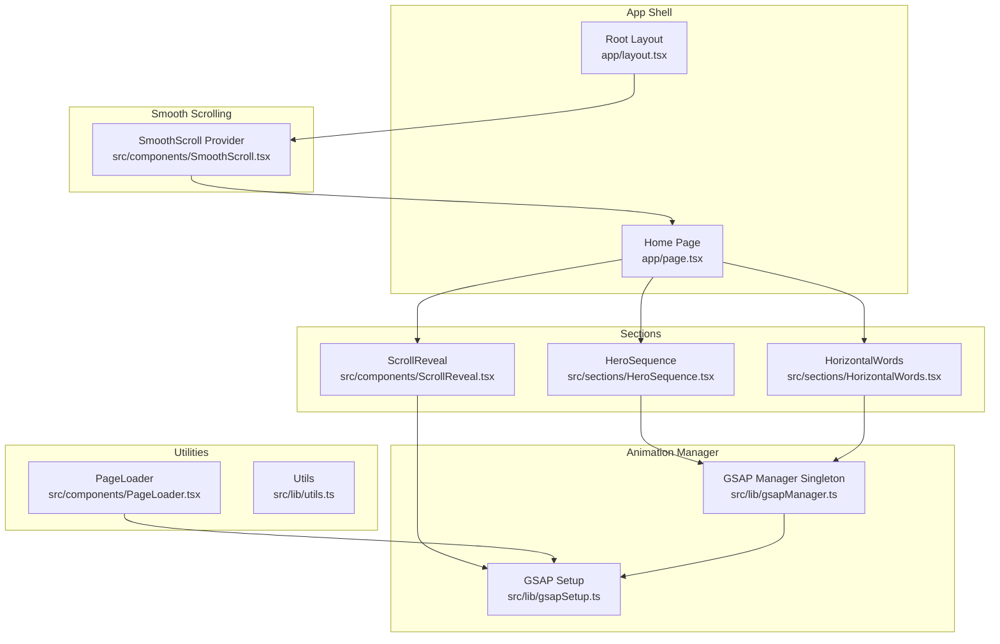
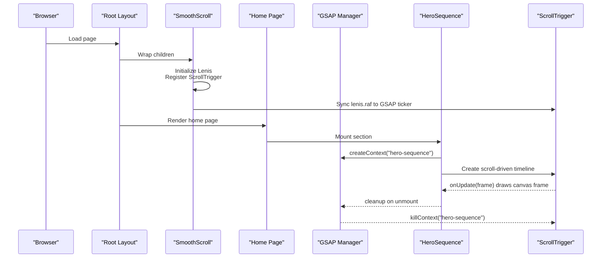
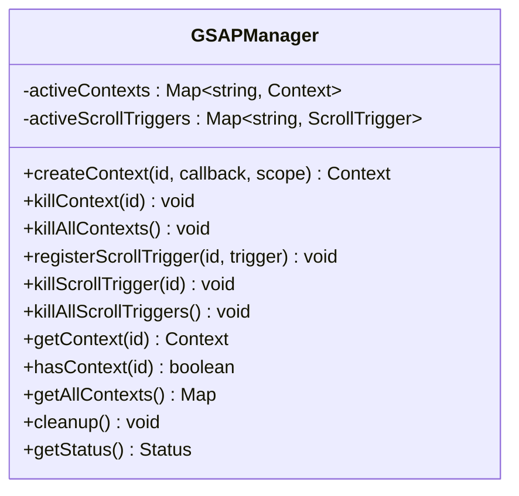
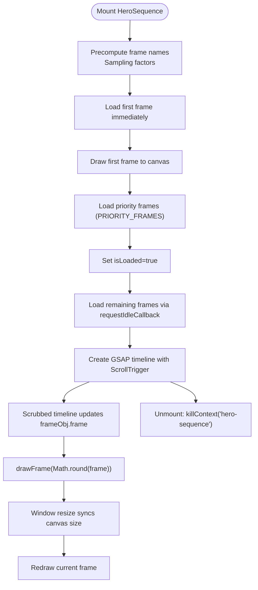
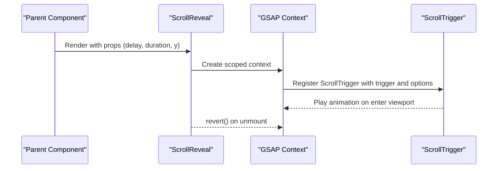
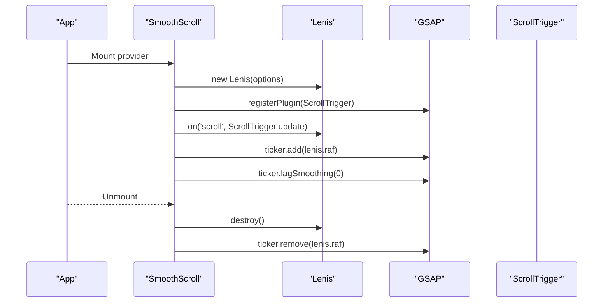
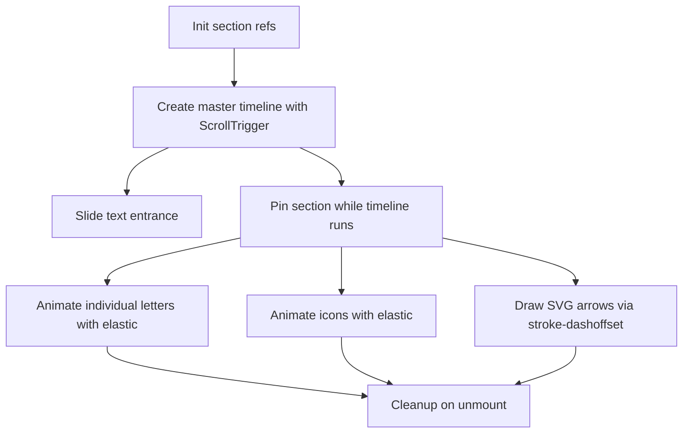
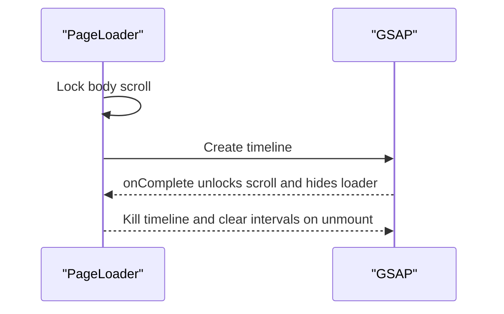
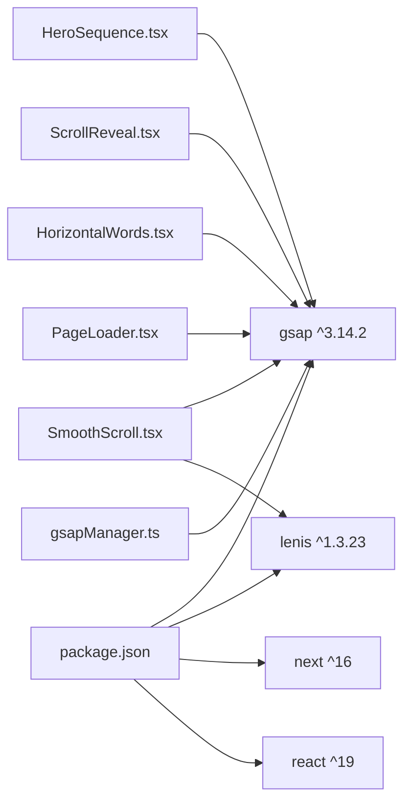

# Animation System

<cite>
**Referenced Files in This Document**
- [gsapManager.ts](file://src/lib/gsapManager.ts)
- [HeroSequence.tsx](file://src/sections/HeroSequence.tsx)
- [SmoothScroll.tsx](file://src/components/SmoothScroll.tsx)
- [ScrollReveal.tsx](file://src/components/ScrollReveal.tsx)
- [gsapSetup.ts](file://src/lib/gsapSetup.ts)
- [HorizontalWords.tsx](file://src/sections/HorizontalWords.tsx)
- [PageLoader.tsx](file://src/components/PageLoader.tsx)
- [layout.tsx](file://app/layout.tsx)
- [page.tsx](file://app/page.tsx)
- [package.json](file://package.json)
</cite>

## Table of Contents
1. [Introduction](#introduction)
2. [Project Structure](#project-structure)
3. [Core Components](#core-components)
4. [Architecture Overview](#architecture-overview)
5. [Detailed Component Analysis](#detailed-component-analysis)
6. [Dependency Analysis](#dependency-analysis)
7. [Performance Considerations](#performance-considerations)
8. [Troubleshooting Guide](#troubleshooting-guide)
9. [Conclusion](#conclusion)
10. [Appendices](#appendices)

## Introduction
This document explains the animation system powering the Digital Addis website. It focuses on the centralized GSAP animation manager singleton pattern, lifecycle management, and memory leak prevention strategies. It also documents the hero sequence implementation with canvas-based animation, frame sampling techniques, and scroll-triggered timeline integration. Additional topics include scroll reveal effects, smooth scroll integration, performance optimization, configuration options, timing/easing, responsive behavior, composition and state management, cleanup procedures, debugging, performance monitoring, and cross-browser compatibility.

## Project Structure
The animation system is composed of:
- A centralized GSAP manager singleton for context and ScrollTrigger lifecycle control
- A hero sequence with canvas-based frame playback and scroll-driven timelines
- Scroll reveal components for fade-in-on-scroll effects
- A smooth scroll provider integrating Lenis with GSAP ScrollTrigger
- Utility modules for GSAP registration and shared helpers
- Application-level integration in the root layout and home page

**Diagram sources**
- [layout.tsx:164-219](file://app/layout.tsx#L164-L219)
- [page.tsx:102-166](file://app/page.tsx#L102-L166)
- [SmoothScroll.tsx:8-46](file://src/components/SmoothScroll.tsx#L8-L46)
- [gsapManager.ts:10-128](file://src/lib/gsapManager.ts#L10-L128)
- [gsapSetup.ts:1-11](file://src/lib/gsapSetup.ts#L1-L11)
- [HeroSequence.tsx:37-373](file://src/sections/HeroSequence.tsx#L37-L373)
- [ScrollReveal.tsx:15-65](file://src/components/ScrollReveal.tsx#L15-L65)
- [HorizontalWords.tsx:9-173](file://src/sections/HorizontalWords.tsx#L9-L173)
- [PageLoader.tsx:7-104](file://src/components/PageLoader.tsx#L7-L104)

**Section sources**
- [layout.tsx:164-219](file://app/layout.tsx#L164-L219)
- [page.tsx:102-166](file://app/page.tsx#L102-L166)

## Core Components
- GSAP Manager Singleton: centralizes creation, tracking, and cleanup of GSAP contexts and ScrollTriggers to prevent memory leaks and ensure deterministic lifecycle management.
- HeroSequence: canvas-based animated hero with precomputed frame sampling, progressive image loading, and a multi-part scroll-driven timeline.
- SmoothScroll: integrates Lenis smooth scroll with GSAP ScrollTrigger and ticker synchronization.
- ScrollReveal: reusable component for fade-in-on-scroll with configurable delay, duration, and vertical offset.
- GSAP Setup: registers ScrollTrigger plugin for client-side usage across components.
- HorizontalWords: advanced scroll-driven marquee with pinning, scrubbed animations, and SVG stroke drawing.
- PageLoader: full-screen loader with GSAP-driven entrance and exit, including progress simulation.

**Section sources**
- [gsapManager.ts:10-128](file://src/lib/gsapManager.ts#L10-L128)
- [HeroSequence.tsx:37-373](file://src/sections/HeroSequence.tsx#L37-L373)
- [SmoothScroll.tsx:8-46](file://src/components/SmoothScroll.tsx#L8-L46)
- [ScrollReveal.tsx:15-65](file://src/components/ScrollReveal.tsx#L15-L65)
- [gsapSetup.ts:1-11](file://src/lib/gsapSetup.ts#L1-L11)
- [HorizontalWords.tsx:9-173](file://src/sections/HorizontalWords.tsx#L9-L173)
- [PageLoader.tsx:7-104](file://src/components/PageLoader.tsx#L7-L104)

## Architecture Overview
The animation architecture centers on a singleton manager that scopes GSAP contexts per component and tracks ScrollTriggers. Scroll-driven animations rely on ScrollTrigger with scrubbed timelines. Smooth scrolling is coordinated via Lenis synchronized to GSAP’s ticker. The hero sequence composes canvas rendering with GSAP timelines to achieve precise frame control during scroll.

**Diagram sources**
- [layout.tsx:205-215](file://app/layout.tsx#L205-L215)
- [SmoothScroll.tsx:9-42](file://src/components/SmoothScroll.tsx#L9-L42)
- [page.tsx:102-166](file://app/page.tsx#L102-L166)
- [HeroSequence.tsx:175-275](file://src/sections/HeroSequence.tsx#L175-L275)
- [gsapManager.ts:17-47](file://src/lib/gsapManager.ts#L17-L47)

## Detailed Component Analysis

### GSAP Manager Singleton Pattern
The manager provides:
- Named contexts with automatic cleanup on reuse
- Tracking and killing of ScrollTriggers by id
- Global cleanup routines
- Debug status reporting

Key behaviors:
- Creating contexts with optional scope
- Reverting contexts and killing ScrollTriggers
- Preventing duplicate registrations by id
- Exposing status for debugging

**Diagram sources**
- [gsapManager.ts:10-128](file://src/lib/gsapManager.ts#L10-L128)

**Section sources**
- [gsapManager.ts:10-128](file://src/lib/gsapManager.ts#L10-L128)

### Hero Sequence: Canvas-Based Animation and Scroll-Driven Timeline
Highlights:
- Frame sampling: precomputes frame filenames and samples to reduce asset count while preserving motion quality.
- Progressive image loading: immediate first-frame draw, priority frames, then idle-time loading.
- Canvas rendering: cover-mode scaling with watermark cropping adjustments; redraw on resize.
- Multi-part scroll timeline:
  - Part 1: turn sequence with frame progression and hero copy fade.
  - Part 2: elevate brands with model movement and about content reveal.
  - Part 3: dive sequence with HUD label and model return to center.
- Responsive behavior: adjusts model horizontal position based on viewport width.

**Diagram sources**
- [HeroSequence.tsx:9-36](file://src/sections/HeroSequence.tsx#L9-L36)
- [HeroSequence.tsx:77-156](file://src/sections/HeroSequence.tsx#L77-L156)
- [HeroSequence.tsx:175-275](file://src/sections/HeroSequence.tsx#L175-L275)

**Section sources**
- [HeroSequence.tsx:37-373](file://src/sections/HeroSequence.tsx#L37-L373)

### Scroll Reveal Effects
Features:
- Reusable component with configurable delay, duration, and vertical offset.
- Uses GSAP context-scoped animations with ScrollTrigger.
- Optimized with fast scroll end and one-time execution.

**Diagram sources**
- [ScrollReveal.tsx:24-53](file://src/components/ScrollReveal.tsx#L24-L53)

**Section sources**
- [ScrollReveal.tsx:15-65](file://src/components/ScrollReveal.tsx#L15-L65)

### Smooth Scroll Integration
Integration points:
- Initializes Lenis with tuned easing and wheel/touch multipliers.
- Synchronizes Lenis scroll events with ScrollTrigger updates.
- Hooks Lenis’s raf into GSAP ticker to keep animations in sync.
- Disables GSAP ticker lag smoothing to avoid conflicts.

**Diagram sources**
- [SmoothScroll.tsx:9-42](file://src/components/SmoothScroll.tsx#L9-L42)

**Section sources**
- [SmoothScroll.tsx:8-46](file://src/components/SmoothScroll.tsx#L8-L46)

### Horizontal Words: Advanced Scroll-Driven Composition
Highlights:
- Entrance and pinning logic with separate ScrollTrigger for pinning.
- Letter and icon bounce animations with elastic easing.
- SVG stroke drawing via stroke-dasharray and dashoffset.
- Container-animation linking to a master timeline for coordinated scrubbing.

**Diagram sources**
- [HorizontalWords.tsx:16-121](file://src/sections/HorizontalWords.tsx#L16-L121)

**Section sources**
- [HorizontalWords.tsx:9-173](file://src/sections/HorizontalWords.tsx#L9-L173)

### Page Loader: Full-Screen Entrance and Exit
Highlights:
- Simulates progress with intervals.
- Uses GSAP timeline for entrance and exit with easing.
- Cleans up intervals and kills the timeline on unmount.

**Diagram sources**
- [PageLoader.tsx:11-59](file://src/components/PageLoader.tsx#L11-L59)

**Section sources**
- [PageLoader.tsx:7-104](file://src/components/PageLoader.tsx#L7-L104)

## Dependency Analysis
External libraries and integrations:
- GSAP core and ScrollTrigger for animation orchestration
- Lenis for smooth scroll integration
- Next.js dynamic imports for lazy-loading heavy sections
- Tailwind CSS utilities for responsive behavior

**Diagram sources**
- [package.json:12-63](file://package.json#L12-L63)
- [HeroSequence.tsx:4-7](file://src/sections/HeroSequence.tsx#L4-L7)
- [ScrollReveal.tsx:4](file://src/components/ScrollReveal.tsx#L4)
- [HorizontalWords.tsx:4-6](file://src/sections/HorizontalWords.tsx#L4-L6)
- [SmoothScroll.tsx:4-6](file://src/components/SmoothScroll.tsx#L4-L6)
- [PageLoader.tsx:5](file://src/components/PageLoader.tsx#L5)
- [gsapManager.ts:1-4](file://src/lib/gsapManager.ts#L1-L4)

**Section sources**
- [package.json:12-63](file://package.json#L12-L63)

## Performance Considerations
- Frame sampling and progressive loading:
  - Precompute frame names and skip steps to reduce asset count while maintaining motion quality.
  - Immediate first-frame draw, priority block for initial experience, then idle-time loading.
- Canvas rendering:
  - Cover-mode scaling with over-zoom to crop watermarks; adjust second batch positioning.
  - Redraw on resize to match new pixel dimensions.
- ScrollTrigger optimization:
  - One-time reveals and fast scroll end toggles for reduced churn.
  - Debounced refresh on resize and idle refresh to minimize layout thrash.
- Smooth scroll coordination:
  - Synchronize Lenis raf with GSAP ticker and disable lag smoothing to avoid stutter.
- Lazy loading:
  - Dynamic imports for below-the-fold sections to improve TTFB and initial paint.
- Memory management:
  - Centralized manager reverts contexts and kills ScrollTriggers on unmount.
  - Application-level cleanup of all ScrollTriggers on window unload.

[No sources needed since this section provides general guidance]

## Troubleshooting Guide
Common issues and remedies:
- Animations not cleaning up after navigation:
  - Ensure each component using GSAP contexts calls the manager to kill contexts on unmount.
  - Verify ids are unique and consistent across mounts/unmounts.
- Scroll-trigger not updating after DOM changes:
  - Call debounced refresh on resize and after dynamic content loads.
  - Use invalidateOnRefresh and fastScrollEnd where appropriate.
- Canvas not redrawing after resize:
  - Recompute canvas pixel dimensions and redraw the current frame.
- Conflicts between Lenis and GSAP ticker:
  - Confirm Lenis raf is added to GSAP ticker and lag smoothing is disabled.
- Hero sequence not playing:
  - Confirm first frame loads and drawFrame executes; check frame indices and sampling math.
- Scroll reveal not triggering:
  - Verify trigger element exists and ScrollTrigger defaults are applied.

**Section sources**
- [HeroSequence.tsx:158-173](file://src/sections/HeroSequence.tsx#L158-L173)
- [page.tsx:108-143](file://app/page.tsx#L108-L143)
- [SmoothScroll.tsx:24-41](file://src/components/SmoothScroll.tsx#L24-L41)
- [gsapManager.ts:33-47](file://src/lib/gsapManager.ts#L33-L47)

## Conclusion
The Digital Addis animation system leverages a centralized GSAP manager to enforce strict lifecycle control, preventing memory leaks and ensuring predictable behavior. The hero sequence demonstrates advanced canvas-based animation with frame sampling and scroll-driven timelines. Scroll reveal and smooth scroll components integrate seamlessly with GSAP and Lenis, while performance optimizations and responsive behavior are baked into the implementation. The system is structured for maintainability, composability, and robust cleanup across component lifecycles.

[No sources needed since this section summarizes without analyzing specific files]

## Appendices

### Animation Configuration Options and Timing/Easing
- HeroSequence timeline parts:
  - Turn sequence: scrubbed progression with “none” ease and proportional durations.
  - Elevate brands: matching speed with turn sequence; model movement and content reveal.
  - Dive & HUD: extended sequence with HUD label and model return to center.
- ScrollReveal:
  - Defaults: power3.out, 0.6s duration, 30px vertical offset, 0 delay; configurable via props.
- SmoothScroll:
  - Easing curve derived from exponential function; tuned wheel/touch multipliers.
- HorizontalWords:
  - Elastic bounce easing for letters/icons; SVG stroke drawing via stroke-dashoffset.

**Section sources**
- [HeroSequence.tsx:188-270](file://src/sections/HeroSequence.tsx#L188-L270)
- [ScrollReveal.tsx:18-49](file://src/components/ScrollReveal.tsx#L18-L49)
- [SmoothScroll.tsx:14-34](file://src/components/SmoothScroll.tsx#L14-L34)
- [HorizontalWords.tsx:66-114](file://src/sections/HorizontalWords.tsx#L66-L114)

### Responsive Behavior
- HeroSequence:
  - Adjusts model horizontal position based on viewport width for mobile vs. desktop.
- HorizontalWords:
  - Uses window dimensions for entrance distance and pinned duration calculations.
- General:
  - Debounced resize handlers and refresh calls to adapt to breakpoints.

**Section sources**
- [HeroSequence.tsx:212-240](file://src/sections/HeroSequence.tsx#L212-L240)
- [HorizontalWords.tsx:27-38](file://src/sections/HorizontalWords.tsx#L27-L38)
- [page.tsx:126-133](file://app/page.tsx#L126-L133)

### Animation Composition and State Management
- Composition:
  - Master timelines coordinate multiple elements (model, text, HUD).
  - ScrollTrigger instances are scoped to contexts to avoid global leakage.
- State:
  - isLoaded flag gates timeline creation.
  - loadProgress state reflects asset caching progress.
  - Refs store image arrays and DOM nodes for efficient access.

**Section sources**
- [HeroSequence.tsx:45-47](file://src/sections/HeroSequence.tsx#L45-L47)
- [HeroSequence.tsx:175-275](file://src/sections/HeroSequence.tsx#L175-L275)

### Cleanup Procedures
- Component-level:
  - Revert GSAP contexts and kill ScrollTriggers on unmount.
- Application-level:
  - Refresh ScrollTrigger on resize; kill all ScrollTriggers and clear matchMedia on window unload.
- Loader:
  - Kill intervals and timeline on unmount.

**Section sources**
- [gsapManager.ts:33-47](file://src/lib/gsapManager.ts#L33-L47)
- [page.tsx:135-142](file://app/page.tsx#L135-L142)
- [PageLoader.tsx:53-59](file://src/components/PageLoader.tsx#L53-L59)

### Debugging and Performance Monitoring
- Manager status:
  - Expose context and ScrollTrigger counts and keys for inspection.
- ScrollTrigger defaults:
  - ToggleActions and fastScrollEnd configured globally for consistent behavior.
- Monitoring:
  - Use browser devtools to inspect ScrollTrigger instances and timeline progress.
  - Observe canvas redraws and image loading via network panel.

**Section sources**
- [gsapManager.ts:109-121](file://src/lib/gsapManager.ts#L109-L121)
- [page.tsx:109-113](file://app/page.tsx#L109-L113)

### Cross-Browser Compatibility
- Lenis easing and raf integration:
  - Ensures consistent scroll behavior across browsers.
- GSAP plugin registration:
  - Registered once per module/client initialization.
- Canvas rendering:
  - Uses standard 2D context; cover-mode scaling adapts to device pixel ratio via explicit canvas sizing.

**Section sources**
- [SmoothScroll.tsx:12-34](file://src/components/SmoothScroll.tsx#L12-L34)
- [HeroSequence.tsx:90-94](file://src/sections/HeroSequence.tsx#L90-L94)
- [gsapSetup.ts:6-8](file://src/lib/gsapSetup.ts#L6-L8)