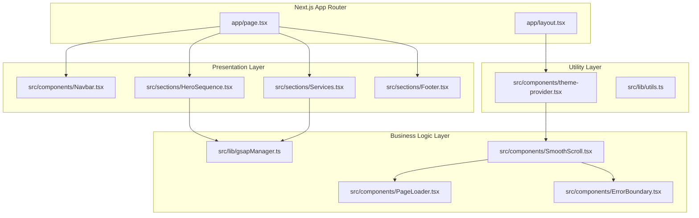
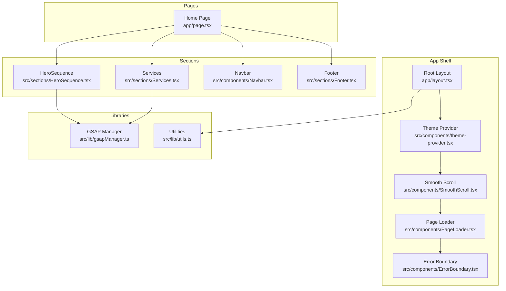
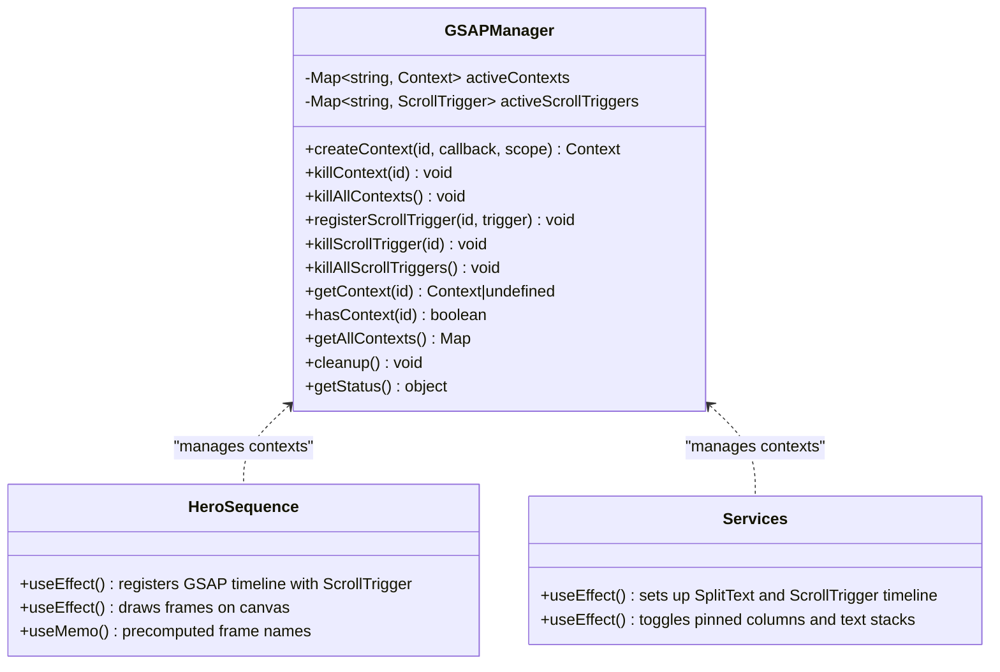
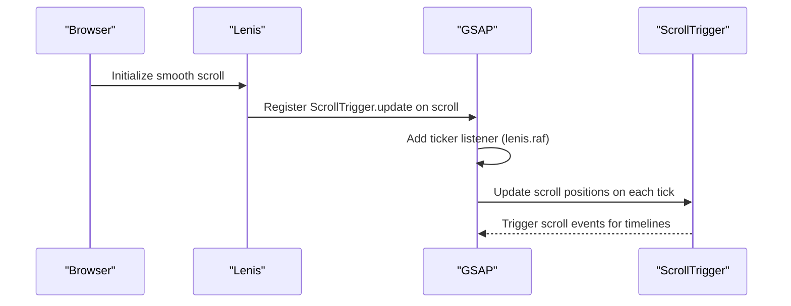
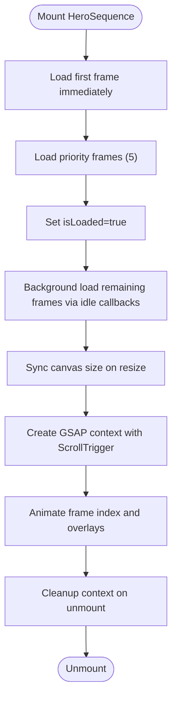
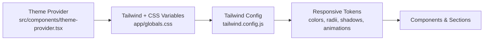
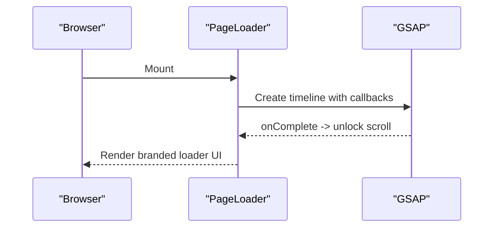
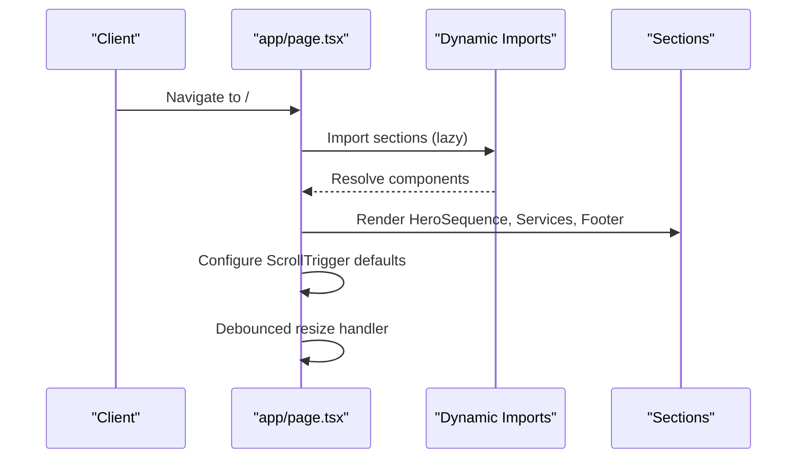
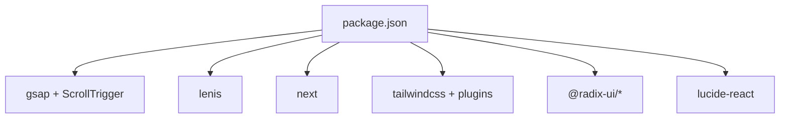

# Architecture Overview

<cite>
**Referenced Files in This Document**
- [package.json](file://package.json)
- [next.config.js](file://next.config.js)
- [tailwind.config.js](file://tailwind.config.js)
- [app/layout.tsx](file://app/layout.tsx)
- [app/page.tsx](file://app/page.tsx)
- [app/globals.css](file://app/globals.css)
- [src/lib/gsapManager.ts](file://src/lib/gsapManager.ts)
- [src/lib/utils.ts](file://src/lib/utils.ts)
- [src/components/theme-provider.tsx](file://src/components/theme-provider.tsx)
- [src/components/SmoothScroll.tsx](file://src/components/SmoothScroll.tsx)
- [src/components/PageLoader.tsx](file://src/components/PageLoader.tsx)
- [src/components/ErrorBoundary.tsx](file://src/components/ErrorBoundary.tsx)
- [src/components/Navbar.tsx](file://src/components/Navbar.tsx)
- [src/sections/HeroSequence.tsx](file://src/sections/HeroSequence.tsx)
- [src/sections/Services.tsx](file://src/sections/Services.tsx)
- [src/sections/Footer.tsx](file://src/sections/Footer.tsx)
</cite>

## Table of Contents
1. [Introduction](#introduction)
2. [Project Structure](#project-structure)
3. [Core Components](#core-components)
4. [Architecture Overview](#architecture-overview)
5. [Detailed Component Analysis](#detailed-component-analysis)
6. [Dependency Analysis](#dependency-analysis)
7. [Performance Considerations](#performance-considerations)
8. [Troubleshooting Guide](#troubleshooting-guide)
9. [Conclusion](#conclusion)

## Introduction
This document describes the architecture of the Digital Addis website built with Next.js App Router. The design emphasizes a layered structure:
- Presentation layer: reusable components and specialized sections
- Business logic layer: hooks and libraries encapsulating animation and utility logic
- Utility layer: theme provider, animation manager, and shared utilities

It documents the animation architecture using GSAP with a singleton manager, the theme provider pattern, responsive design tokens, and integration patterns across pages and sections. It also outlines system boundaries, component interactions, data flows, and performance optimizations such as canvas-based animations, lazy loading, and Next.js optimizations.

## Project Structure
The project follows Next.js App Router conventions with:
- app/: route handlers and layouts
- src/components/: UI primitives and shared components
- src/sections/: page-specific, feature-rich sections
- src/lib/: centralized utilities and managers (GSAP, utilities)

**Diagram sources**
- [app/layout.tsx:164-216](file://app/layout.tsx#L164-L216)
- [app/page.tsx:102-165](file://app/page.tsx#L102-L165)
- [src/components/Navbar.tsx:39-208](file://src/components/Navbar.tsx#L39-L208)
- [src/sections/HeroSequence.tsx:43-376](file://src/sections/HeroSequence.tsx#L43-L376)
- [src/sections/Services.tsx:72-324](file://src/sections/Services.tsx#L72-L324)
- [src/sections/Footer.tsx:45-157](file://src/sections/Footer.tsx#L45-L157)
- [src/lib/gsapManager.ts:10-127](file://src/lib/gsapManager.ts#L10-L127)
- [src/components/SmoothScroll.tsx:8-45](file://src/components/SmoothScroll.tsx#L8-L45)
- [src/components/PageLoader.tsx:6-97](file://src/components/PageLoader.tsx#L6-L97)
- [src/components/ErrorBoundary.tsx:16-60](file://src/components/ErrorBoundary.tsx#L16-L60)
- [src/components/theme-provider.tsx:7-9](file://src/components/theme-provider.tsx#L7-L9)
- [src/lib/utils.ts:4-6](file://src/lib/utils.ts#L4-L6)

**Section sources**
- [app/layout.tsx:164-216](file://app/layout.tsx#L164-L216)
- [app/page.tsx:102-165](file://app/page.tsx#L102-L165)
- [src/components/Navbar.tsx:39-208](file://src/components/Navbar.tsx#L39-L208)
- [src/sections/HeroSequence.tsx:43-376](file://src/sections/HeroSequence.tsx#L43-L376)
- [src/sections/Services.tsx:72-324](file://src/sections/Services.tsx#L72-L324)
- [src/sections/Footer.tsx:45-157](file://src/sections/Footer.tsx#L45-L157)
- [src/lib/gsapManager.ts:10-127](file://src/lib/gsapManager.ts#L10-L127)
- [src/components/SmoothScroll.tsx:8-45](file://src/components/SmoothScroll.tsx#L8-L45)
- [src/components/PageLoader.tsx:6-97](file://src/components/PageLoader.tsx#L6-L97)
- [src/components/ErrorBoundary.tsx:16-60](file://src/components/ErrorBoundary.tsx#L16-L60)
- [src/components/theme-provider.tsx:7-9](file://src/components/theme-provider.tsx#L7-L9)
- [src/lib/utils.ts:4-6](file://src/lib/utils.ts#L4-L6)

## Core Components
- Theme Provider: wraps the app with theme awareness and persistence.
- Smooth Scroll: integrates Lenis with GSAP ScrollTrigger for synchronized smooth scrolling.
- Page Loader: premium animated loader using GSAP timelines.
- Error Boundary: graceful error handling with optional custom fallback.
- GSAP Manager: centralized singleton managing contexts and scroll triggers to prevent leaks.
- Utilities: shared Tailwind and clsx/tailwind-merge helpers.

Key responsibilities:
- Presentation: components and sections render content and orchestrate per-section animations.
- Business logic: hooks and managers coordinate lifecycle, performance, and scroll-triggered animations.
- Utilities: theme, typography, spacing, and responsive tokens via Tailwind and CSS variables.

**Section sources**
- [src/components/theme-provider.tsx:7-9](file://src/components/theme-provider.tsx#L7-L9)
- [src/components/SmoothScroll.tsx:8-45](file://src/components/SmoothScroll.tsx#L8-L45)
- [src/components/PageLoader.tsx:6-97](file://src/components/PageLoader.tsx#L6-L97)
- [src/components/ErrorBoundary.tsx:16-60](file://src/components/ErrorBoundary.tsx#L16-L60)
- [src/lib/gsapManager.ts:10-127](file://src/lib/gsapManager.ts#L10-L127)
- [src/lib/utils.ts:4-6](file://src/lib/utils.ts#L4-L6)

## Architecture Overview
The system is a layered composition:
- Presentation layer: app/page orchestrates sections and renders the page skeleton.
- Business logic layer: GSAP manager, smooth scroll, and scroll-triggered animations.
- Utility layer: theme provider, responsive design tokens, and shared utilities.

**Diagram sources**
- [app/layout.tsx:164-216](file://app/layout.tsx#L164-L216)
- [app/page.tsx:102-165](file://app/page.tsx#L102-L165)
- [src/components/theme-provider.tsx:7-9](file://src/components/theme-provider.tsx#L7-L9)
- [src/components/SmoothScroll.tsx:8-45](file://src/components/SmoothScroll.tsx#L8-L45)
- [src/components/PageLoader.tsx:6-97](file://src/components/PageLoader.tsx#L6-L97)
- [src/components/ErrorBoundary.tsx:16-60](file://src/components/ErrorBoundary.tsx#L16-L60)
- [src/sections/HeroSequence.tsx:43-376](file://src/sections/HeroSequence.tsx#L43-L376)
- [src/sections/Services.tsx:72-324](file://src/sections/Services.tsx#L72-L324)
- [src/components/Navbar.tsx:39-208](file://src/components/Navbar.tsx#L39-L208)
- [src/sections/Footer.tsx:45-157](file://src/sections/Footer.tsx#L45-L157)
- [src/lib/gsapManager.ts:10-127](file://src/lib/gsapManager.ts#L10-L127)
- [src/lib/utils.ts:4-6](file://src/lib/utils.ts#L4-L6)

## Detailed Component Analysis

### Animation Architecture: GSAP Singleton and Scroll-Triggered Sections
The animation system centers on a singleton GSAP manager that:
- Creates named contexts scoped to sections
- Registers and tracks ScrollTrigger instances
- Provides cleanup APIs to avoid memory leaks
- Exposes status for debugging

**Diagram sources**
- [src/lib/gsapManager.ts:10-127](file://src/lib/gsapManager.ts#L10-L127)
- [src/sections/HeroSequence.tsx:181-281](file://src/sections/HeroSequence.tsx#L181-L281)
- [src/sections/Services.tsx:117-193](file://src/sections/Services.tsx#L117-L193)

**Section sources**
- [src/lib/gsapManager.ts:10-127](file://src/lib/gsapManager.ts#L10-L127)
- [src/sections/HeroSequence.tsx:43-376](file://src/sections/HeroSequence.tsx#L43-L376)
- [src/sections/Services.tsx:72-324](file://src/sections/Services.tsx#L72-L324)

### Smooth Scrolling and ScrollTrigger Integration
Lenis provides smooth wheel/touch scrolling; its requestAnimationFrame is synchronized with GSAP’s ticker to keep ScrollTrigger updates in lockstep. This prevents jank and ensures scroll-triggered animations run smoothly.

**Diagram sources**
- [src/components/SmoothScroll.tsx:8-45](file://src/components/SmoothScroll.tsx#L8-L45)

**Section sources**
- [src/components/SmoothScroll.tsx:8-45](file://src/components/SmoothScroll.tsx#L8-L45)

### Canvas-Based Hero Sequence Animation
The HeroSequence component uses a canvas to render a high-resolution image sequence with:
- Precomputed frame names for deterministic playback
- Priority-first loading with immediate first-frame rendering
- Idle-friendly background loading using requestIdleCallback or fallback timers
- Resize-aware canvas synchronization
- Scroll-triggered timeline controlling frame indices and overlay transitions

**Diagram sources**
- [src/sections/HeroSequence.tsx:83-162](file://src/sections/HeroSequence.tsx#L83-L162)
- [src/sections/HeroSequence.tsx:181-281](file://src/sections/HeroSequence.tsx#L181-L281)

**Section sources**
- [src/sections/HeroSequence.tsx:43-376](file://src/sections/HeroSequence.tsx#L43-L376)

### Theme Provider Pattern and Responsive Design System
The theme provider enables system-aware theming with persistent preferences. Tailwind utilities and CSS variables define responsive breakpoints, typography scales, shadows, and color tokens. The design system leverages:
- CSS variables for background/foreground and primary/accent colors
- Tailwind theme extensions for radius, shadows, and animation keyframes
- Global styles for performance hints (will-change), marquee animations, and reduced-motion support

**Diagram sources**
- [src/components/theme-provider.tsx:7-9](file://src/components/theme-provider.tsx#L7-L9)
- [app/globals.css:23-95](file://app/globals.css#L23-L95)
- [tailwind.config.js:12-111](file://tailwind.config.js#L12-L111)

**Section sources**
- [src/components/theme-provider.tsx:7-9](file://src/components/theme-provider.tsx#L7-L9)
- [app/globals.css:1-760](file://app/globals.css#L1-L760)
- [tailwind.config.js:1-112](file://tailwind.config.js#L1-L112)

### Page Loader and Error Boundaries
The page loader uses GSAP timelines to animate a branded loading experience with progress feedback. The error boundary provides a fallback UI and logs errors for diagnostics.

**Diagram sources**
- [src/components/PageLoader.tsx:6-56](file://src/components/PageLoader.tsx#L6-L56)

**Section sources**
- [src/components/PageLoader.tsx:6-97](file://src/components/PageLoader.tsx#L6-L97)
- [src/components/ErrorBoundary.tsx:16-60](file://src/components/ErrorBoundary.tsx#L16-L60)

### App Router Pages and Shared Components
The home page dynamically imports below-the-fold sections to defer heavy bundles until after initial paint. It configures ScrollTrigger defaults and performs debounced refreshes on resize. The navbar is memoized and optimized for scroll and resize events.

**Diagram sources**
- [app/page.tsx:35-95](file://app/page.tsx#L35-L95)
- [app/page.tsx:102-143](file://app/page.tsx#L102-L143)
- [src/components/Navbar.tsx:39-79](file://src/components/Navbar.tsx#L39-L79)

**Section sources**
- [app/page.tsx:35-95](file://app/page.tsx#L35-L95)
- [app/page.tsx:102-143](file://app/page.tsx#L102-L143)
- [src/components/Navbar.tsx:39-208](file://src/components/Navbar.tsx#L39-L208)

## Dependency Analysis
External dependencies relevant to architecture:
- GSAP ecosystem for animations and scroll-triggered effects
- Lenis for smooth scrolling
- Next.js App Router for file-based routing and SSR/SSG
- Tailwind CSS for design tokens and responsive utilities
- Radix UI and Lucide React for accessible UI primitives

**Diagram sources**
- [package.json:12-65](file://package.json#L12-L65)

**Section sources**
- [package.json:12-65](file://package.json#L12-L65)

## Performance Considerations
- Next.js optimizations:
  - Production compression and headers for security and caching
  - Image optimization with modern formats and aggressive caching
  - On-demand entries and experimental optimizePackageImports
- Animation performance:
  - GSAP manager centralizes contexts and ScrollTriggers to prevent leaks
  - Canvas-based hero sequence reduces DOM overhead and leverages GPU
  - Idle-friendly loading with requestIdleCallback and fallback timers
  - Debounced ScrollTrigger refresh on resize
- Rendering:
  - Dynamic imports for below-the-fold sections
  - Skeleton placeholders to reduce layout shift
  - Tailwind utilities and CSS variables for efficient styling
- Accessibility:
  - Reduced-motion and high-contrast support
  - Focus-visible and skip-link utilities

**Section sources**
- [next.config.js:1-101](file://next.config.js#L1-L101)
- [src/lib/gsapManager.ts:10-127](file://src/lib/gsapManager.ts#L10-L127)
- [src/sections/HeroSequence.tsx:83-162](file://src/sections/HeroSequence.tsx#L83-L162)
- [app/page.tsx:102-143](file://app/page.tsx#L102-L143)
- [app/globals.css:690-760](file://app/globals.css#L690-L760)

## Troubleshooting Guide
- Animation not updating on resize:
  - Ensure ScrollTrigger refresh is called after debounce and that contexts are cleaned up on unmount.
- Scroll-triggered animations stutter:
  - Verify Lenis ticker is synchronized with GSAP and lag smoothing is disabled for ticker.
- Memory leaks or overlapping animations:
  - Confirm contexts and ScrollTriggers are killed via the GSAP manager before remounting.
- Theme not persisting:
  - Check theme provider props and ensure system preference is disabled if needed.
- Page loader not hiding:
  - Verify timeline completion callback unlocks scroll and removes loader.

**Section sources**
- [src/components/SmoothScroll.tsx:8-45](file://src/components/SmoothScroll.tsx#L8-L45)
- [src/lib/gsapManager.ts:10-127](file://src/lib/gsapManager.ts#L10-L127)
- [src/components/theme-provider.tsx:7-9](file://src/components/theme-provider.tsx#L7-L9)
- [src/components/PageLoader.tsx:6-56](file://src/components/PageLoader.tsx#L6-L56)

## Conclusion
The Digital Addis website employs a clean, layered architecture leveraging Next.js App Router, a centralized GSAP manager, and a robust theme and responsive design system. The combination of canvas-based animations, lazy loading, and performance-conscious scroll handling yields a smooth, accessible, and scalable user experience.