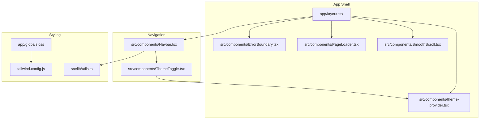
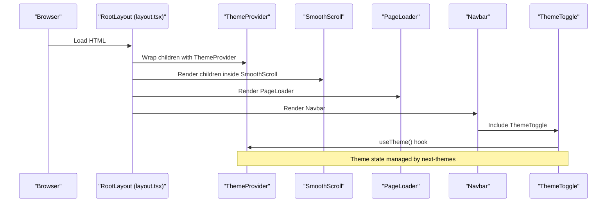
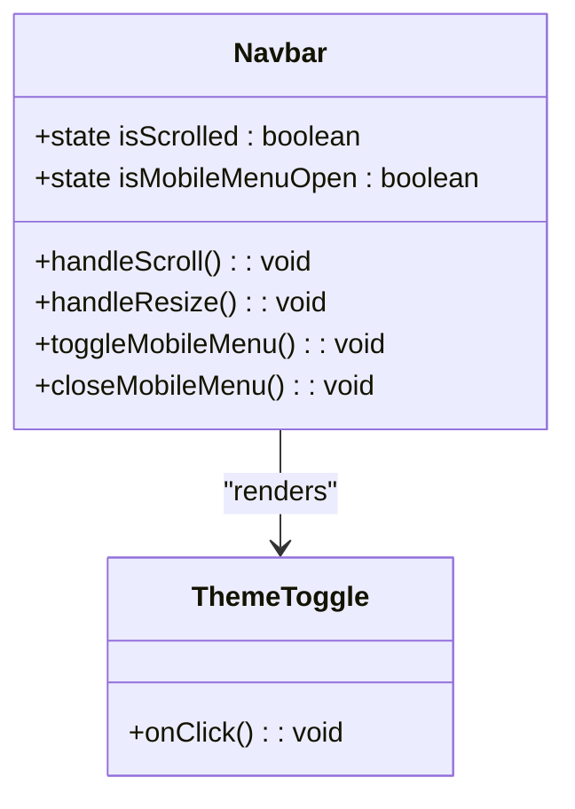
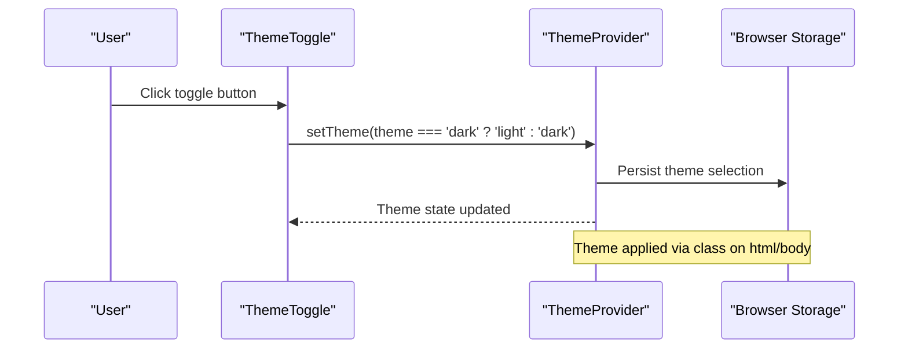
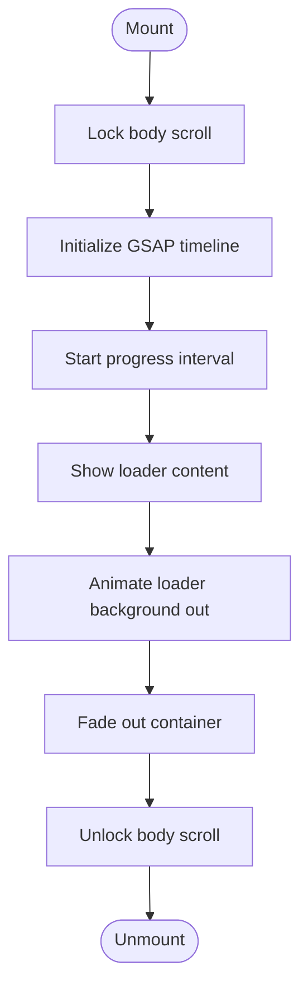
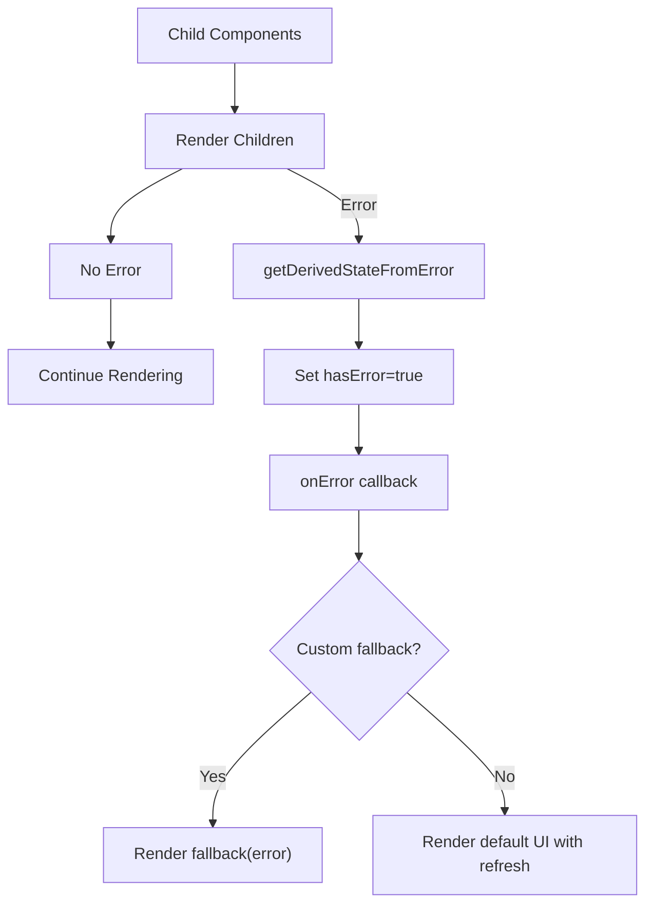
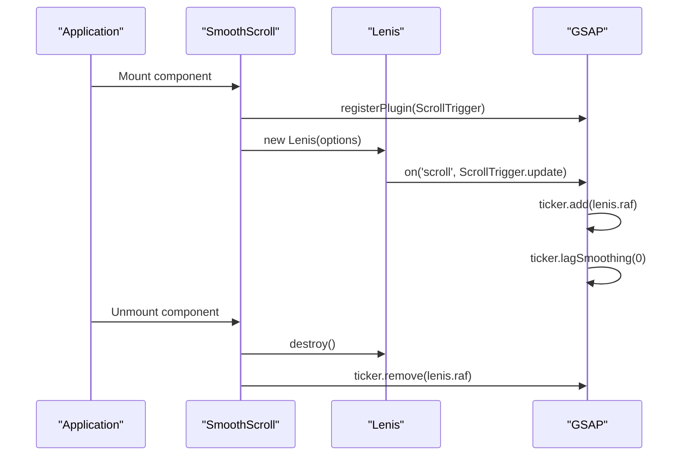
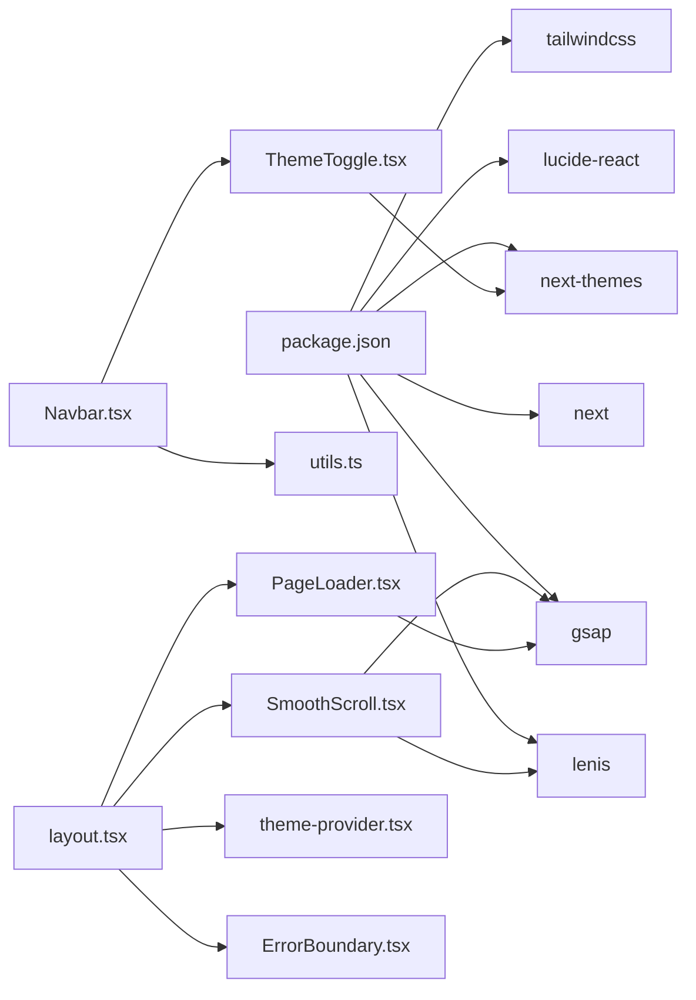

# Core Components

<cite>
**Referenced Files in This Document**
- [Navbar.tsx](file://src/components/Navbar.tsx)
- [ThemeToggle.tsx](file://src/components/ThemeToggle.tsx)
- [theme-provider.tsx](file://src/components/theme-provider.tsx)
- [PageLoader.tsx](file://src/components/PageLoader.tsx)
- [ErrorBoundary.tsx](file://src/components/ErrorBoundary.tsx)
- [SmoothScroll.tsx](file://src/components/SmoothScroll.tsx)
- [layout.tsx](file://app/layout.tsx)
- [page.tsx](file://app/page.tsx)
- [globals.css](file://app/globals.css)
- [utils.ts](file://src/lib/utils.ts)
- [package.json](file://package.json)
- [tailwind.config.js](file://tailwind.config.js)
</cite>

## Table of Contents
1. [Introduction](#introduction)
2. [Project Structure](#project-structure)
3. [Core Components](#core-components)
4. [Architecture Overview](#architecture-overview)
5. [Detailed Component Analysis](#detailed-component-analysis)
6. [Dependency Analysis](#dependency-analysis)
7. [Performance Considerations](#performance-considerations)
8. [Troubleshooting Guide](#troubleshooting-guide)
9. [Conclusion](#conclusion)

## Introduction
This document provides comprehensive documentation for the core UI components of the Digital Addis website. It focuses on:
- Navigation system: responsive navbar, mobile menu, and smooth scrolling integration
- Theme management: dark/light mode switching, system preference detection, and persistence
- Page loader: performance optimization during initial load
- Error boundary: graceful error handling
- Smooth scroll integration: enhanced scrolling experience

It covers component props, events, styling options, accessibility features, usage examples, customization guidelines, and integration patterns with other components. Performance considerations, browser compatibility, and responsive design are addressed throughout.

## Project Structure
The core UI components are organized under the src/components directory and integrated into the Next.js app shell via app/layout.tsx. The Navbar integrates ThemeToggle, while the layout composes ThemeProvider, SmoothScroll, PageLoader, and ErrorBoundary around the application tree.

**Diagram sources**
- [layout.tsx:202-212](file://app/layout.tsx#L202-L212)
- [Navbar.tsx:28-134](file://src/components/Navbar.tsx#L28-L134)
- [ThemeToggle.tsx:4-8](file://src/components/ThemeToggle.tsx#L4-L8)
- [theme-provider.tsx:7-9](file://src/components/theme-provider.tsx#L7-L9)
- [SmoothScroll.tsx:8-45](file://src/components/SmoothScroll.tsx#L8-L45)
- [PageLoader.tsx:6-97](file://src/components/PageLoader.tsx#L6-L97)
- [ErrorBoundary.tsx:16-60](file://src/components/ErrorBoundary.tsx#L16-L60)
- [globals.css:1-117](file://app/globals.css#L1-L117)
- [utils.ts:4-6](file://src/lib/utils.ts#L4-L6)
- [tailwind.config.js:1-112](file://tailwind.config.js#L1-L112)

**Section sources**
- [layout.tsx:202-212](file://app/layout.tsx#L202-L212)
- [globals.css:1-117](file://app/globals.css#L1-L117)
- [tailwind.config.js:1-112](file://tailwind.config.js#L1-L112)

## Core Components
This section summarizes the responsibilities and integration points of each core component.

- Navbar: Fixed-position responsive navigation with desktop and mobile views, active link highlighting, and mobile menu overlay with staggered animations.
- ThemeToggle: Toggle button for switching between dark and light themes with icon rotation and accessibility attributes.
- ThemeProvider: Wrapper around next-themes to manage theme state and persistence.
- PageLoader: Animated loader with progress simulation and timeline-based animations using GSAP.
- ErrorBoundary: React error boundary component to gracefully handle runtime errors.
- SmoothScroll: Integrates Lenis smooth scrolling with GSAP ScrollTrigger synchronization.

**Section sources**
- [Navbar.tsx:39-208](file://src/components/Navbar.tsx#L39-L208)
- [ThemeToggle.tsx:7-31](file://src/components/ThemeToggle.tsx#L7-L31)
- [theme-provider.tsx:7-9](file://src/components/theme-provider.tsx#L7-L9)
- [PageLoader.tsx:6-97](file://src/components/PageLoader.tsx#L6-L97)
- [ErrorBoundary.tsx:16-60](file://src/components/ErrorBoundary.tsx#L16-L60)
- [SmoothScroll.tsx:8-45](file://src/components/SmoothScroll.tsx#L8-L45)

## Architecture Overview
The application initializes theme management, smooth scrolling, and loaders at the root layout level. The Navbar is rendered on pages and depends on ThemeToggle for theme switching. Styling relies on Tailwind CSS with CSS variables for theme tokens.

**Diagram sources**
- [layout.tsx:202-212](file://app/layout.tsx#L202-L212)
- [SmoothScroll.tsx:8-45](file://src/components/SmoothScroll.tsx#L8-L45)
- [PageLoader.tsx:6-97](file://src/components/PageLoader.tsx#L6-L97)
- [Navbar.tsx:28-134](file://src/components/Navbar.tsx#L28-L134)
- [ThemeToggle.tsx:7-31](file://src/components/ThemeToggle.tsx#L7-L31)
- [theme-provider.tsx:7-9](file://src/components/theme-provider.tsx#L7-L9)

## Detailed Component Analysis

### Navigation System (Navbar)
Responsibilities:
- Fixed-position header with scroll-aware scaling and opacity transitions
- Desktop navigation with active link highlighting
- Mobile menu overlay with staggered entrance animations
- ThemeToggle integration in both desktop and mobile contexts
- Accessibility: aria-labels, aria-expanded, aria-controls, and aria-hidden usage

Key behaviors:
- Scroll listener with requestAnimationFrame throttling to update header appearance
- Resize listener to close mobile menu when screen becomes wide enough
- Memoized callbacks for toggling and closing mobile menu
- Conditional rendering of desktop vs mobile branding and controls

Props and slots:
- No explicit props; uses internal state and pathname for active link detection
- Uses Link from next/navigation for client-side navigation

Accessibility features:
- Proper aria-labels for navigation and buttons
- aria-expanded on mobile menu button reflects open/closed state
- aria-controls links the button to the mobile menu container
- Focus-visible outlines and skip-to-content patterns in global styles

Styling options:
- Tailwind classes for spacing, borders, backgrounds, and backdrop blur
- CSS variables for theme-aware colors
- Responsive breakpoints for desktop/mobile layouts

Integration:
- Consumed by page components (e.g., app/page.tsx)
- Depends on ThemeToggle and cn utility for styling

**Section sources**
- [Navbar.tsx:39-208](file://src/components/Navbar.tsx#L39-L208)
- [page.tsx:145-164](file://app/page.tsx#L145-L164)
- [utils.ts:4-6](file://src/lib/utils.ts#L4-L6)
- [globals.css:720-740](file://app/globals.css#L720-L740)

#### Navbar Class Diagram

**Diagram sources**
- [Navbar.tsx:39-208](file://src/components/Navbar.tsx#L39-L208)
- [ThemeToggle.tsx:7-31](file://src/components/ThemeToggle.tsx#L7-L31)

### Theme Management System
Responsibilities:
- ThemeToggle: Switches between dark and light modes and renders sun/moon icons with rotation transitions
- ThemeProvider: Wraps the app with next-themes provider configured for class-based theme switching

Configuration:
- ThemeProvider configured with attribute="class", defaultTheme="dark", enableSystem=false, disableTransitionOnChange
- ThemeToggle uses next-themes useTheme hook to read and update theme state
- Hydration-safe rendering with a mounted guard to avoid mismatches

Persistence and preferences:
- Theme persistence is handled by next-themes; the provider stores the selected theme in localStorage
- System preference detection is disabled (enableSystem=false) to enforce a single theme mode

Accessibility:
- ThemeToggle includes aria-label and sr-only span for assistive technologies

**Section sources**
- [theme-provider.tsx:7-9](file://src/components/theme-provider.tsx#L7-L9)
- [ThemeToggle.tsx:7-31](file://src/components/ThemeToggle.tsx#L7-L31)
- [layout.tsx:202-207](file://app/layout.tsx#L202-L207)

#### Theme Management Flow

**Diagram sources**
- [ThemeToggle.tsx:21-29](file://src/components/ThemeToggle.tsx#L21-L29)
- [theme-provider.tsx:7-9](file://src/components/theme-provider.tsx#L7-L9)
- [layout.tsx:202-207](file://app/layout.tsx#L202-L207)

### Page Loader Component
Responsibilities:
- Provides an immersive loading experience during initial page load
- Simulates progress with a timer and displays a progress bar
- Uses GSAP timeline to orchestrate entrance, progress, and exit animations

Behavior:
- Locks body scroll during loading
- Creates a timeline with set, to, and autoAlpha tweens
- Clears intervals and restores scroll on cleanup
- Hides itself after completion

Props and lifecycle:
- No props; manages internal isLoading and progress state
- Cleanup handles interval clearing and scroll restoration

Styling:
- Uses Tailwind classes for layout and typography
- Brightness inversion for logo in dark mode
- Progress bar built with absolute positioning and width transitions

**Section sources**
- [PageLoader.tsx:6-97](file://src/components/PageLoader.tsx#L6-L97)

#### Page Loader Timeline

**Diagram sources**
- [PageLoader.tsx:10-56](file://src/components/PageLoader.tsx#L10-L56)

### Error Boundary Component
Responsibilities:
- Catches JavaScript errors anywhere in child component trees
- Renders a fallback UI or custom fallback component
- Logs errors to console and invokes optional onError callback

Props:
- children: ReactNode
- fallback?: (error: Error) => ReactNode
- onError?: (error: Error, errorInfo: ErrorInfo) => void

Behavior:
- Static getDerivedStateFromError sets hasError flag
- componentDidCatch logs error and calls onError
- Renders fallback if provided, otherwise renders a default UI with a refresh button

Accessibility:
- Centered layout with clear messaging
- Focusable refresh button for keyboard users

**Section sources**
- [ErrorBoundary.tsx:16-60](file://src/components/ErrorBoundary.tsx#L16-L60)

#### Error Boundary Flow

**Diagram sources**
- [ErrorBoundary.tsx:25-59](file://src/components/ErrorBoundary.tsx#L25-L59)

### Smooth Scroll Integration
Responsibilities:
- Integrates Lenis smooth scrolling with GSAP ScrollTrigger
- Synchronizes Lenis raf with GSAP ticker
- Disables GSAP lag smoothing to prevent conflicts

Configuration:
- Lenis options include duration, easing, orientation, gestureOrientation, smoothWheel, wheelMultiplier, and touchMultiplier
- ScrollTrigger is registered and updated on Lenis scroll events
- GSAP ticker is used to drive Lenis animation frames

Cleanup:
- Destroys Lenis instance and removes ticker listeners on unmount

**Section sources**
- [SmoothScroll.tsx:8-45](file://src/components/SmoothScroll.tsx#L8-L45)

#### Smooth Scroll Sequence

**Diagram sources**
- [SmoothScroll.tsx:9-42](file://src/components/SmoothScroll.tsx#L9-L42)

## Dependency Analysis
External libraries and their roles:
- next-themes: Theme management and persistence
- lucide-react: Icons for ThemeToggle
- lenis: Smooth scrolling engine
- gsap: Animation and ScrollTrigger integration
- next/navigation: Client-side routing and pathname
- next: App shell and metadata
- tailwindcss: Utility-first styling with CSS variables

Internal dependencies:
- Navbar depends on ThemeToggle and cn utility
- ThemeToggle depends on next-themes
- SmoothScroll depends on lenis and gsap
- PageLoader depends on gsap
- ErrorBoundary is standalone

**Diagram sources**
- [package.json:12-63](file://package.json#L12-L63)
- [Navbar.tsx:28-134](file://src/components/Navbar.tsx#L28-L134)
- [ThemeToggle.tsx:4-8](file://src/components/ThemeToggle.tsx#L4-L8)
- [utils.ts:4-6](file://src/lib/utils.ts#L4-L6)
- [SmoothScroll.tsx:4-6](file://src/components/SmoothScroll.tsx#L4-L6)
- [PageLoader.tsx](file://src/components/PageLoader.tsx#L4)
- [layout.tsx:24-26](file://app/layout.tsx#L24-L26)

**Section sources**
- [package.json:12-63](file://package.json#L12-L63)
- [layout.tsx:202-212](file://app/layout.tsx#L202-L212)

## Performance Considerations
- Throttled scroll handling: Navbar uses requestAnimationFrame to minimize layout thrashing
- Passive event listeners: Scroll and resize listeners are passive to improve scrolling performance
- Memoization: Navbar uses memo and useCallback to prevent unnecessary re-renders
- Lazy loading: Pages use dynamic imports for heavy sections to improve TTFB and CLS
- ScrollTrigger optimization: Defaults configured for fastScrollEnd and toggleActions to reduce overhead
- GSAP ticker synchronization: Ensures smooth animations without conflicts
- Body scroll locking: PageLoader temporarily disables scroll to prevent input during animations
- CSS optimizations: Tailwind utilities and CSS variables for efficient styling

[No sources needed since this section provides general guidance]

## Troubleshooting Guide
Common issues and resolutions:
- Theme toggle not switching: Verify ThemeProvider wraps the app and next-themes is installed
- Mobile menu not closing: Ensure resize listener is attached and window.innerWidth check is correct
- Smooth scroll conflicts: Confirm lenis and ScrollTrigger are both registered and synchronized
- Loader not hiding: Check timeline completion and cleanup of intervals and scroll restoration
- Error boundary not catching errors: Ensure ErrorBoundary wraps the intended subtree and fallback is provided if needed

**Section sources**
- [ThemeToggle.tsx:12-18](file://src/components/ThemeToggle.tsx#L12-L18)
- [Navbar.tsx:61-69](file://src/components/Navbar.tsx#L61-L69)
- [SmoothScroll.tsx:12-34](file://src/components/SmoothScroll.tsx#L12-L34)
- [PageLoader.tsx:52-56](file://src/components/PageLoader.tsx#L52-L56)
- [ErrorBoundary.tsx:29-32](file://src/components/ErrorBoundary.tsx#L29-L32)

## Conclusion
The Digital Addis website’s core UI components deliver a polished, accessible, and performant experience. The Navbar provides a responsive navigation system with smooth interactions, ThemeToggle enables seamless theme switching, ThemeProvider manages persistence, PageLoader enhances perceived performance, ErrorBoundary ensures graceful degradation, and SmoothScroll elevates the scrolling experience. Together, they form a cohesive system that balances aesthetics, usability, and performance across devices and browsers.