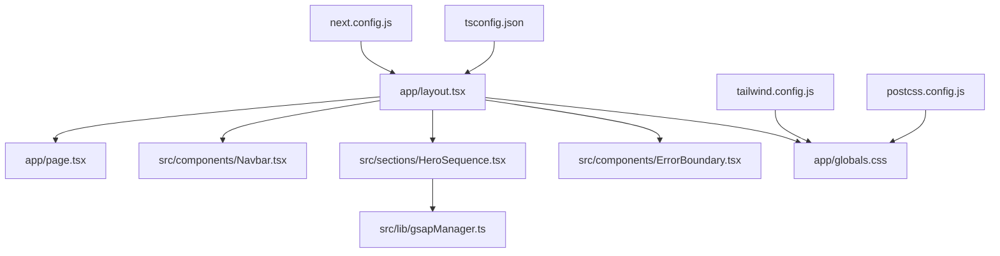
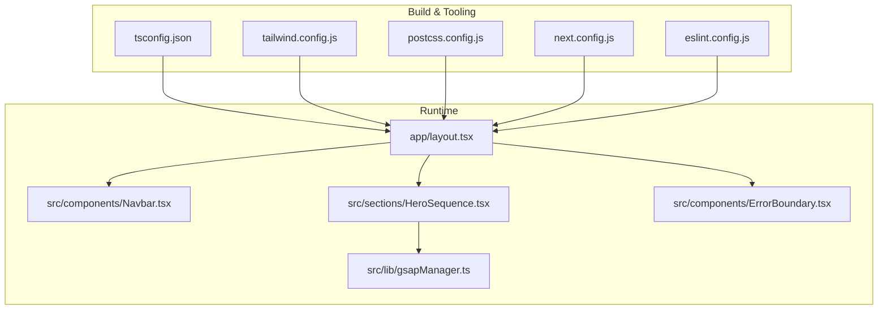
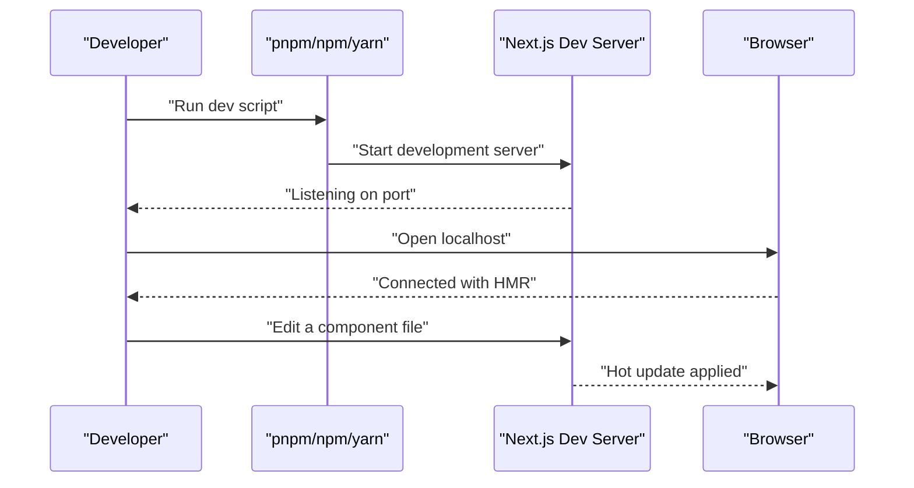
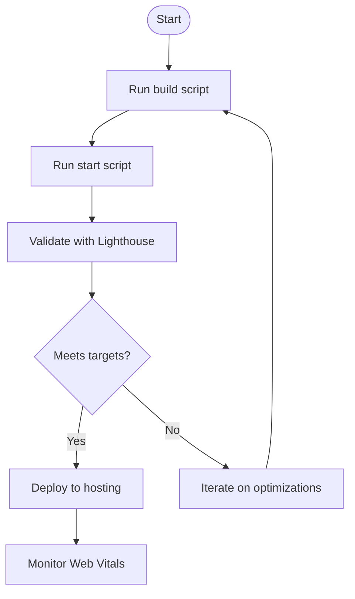
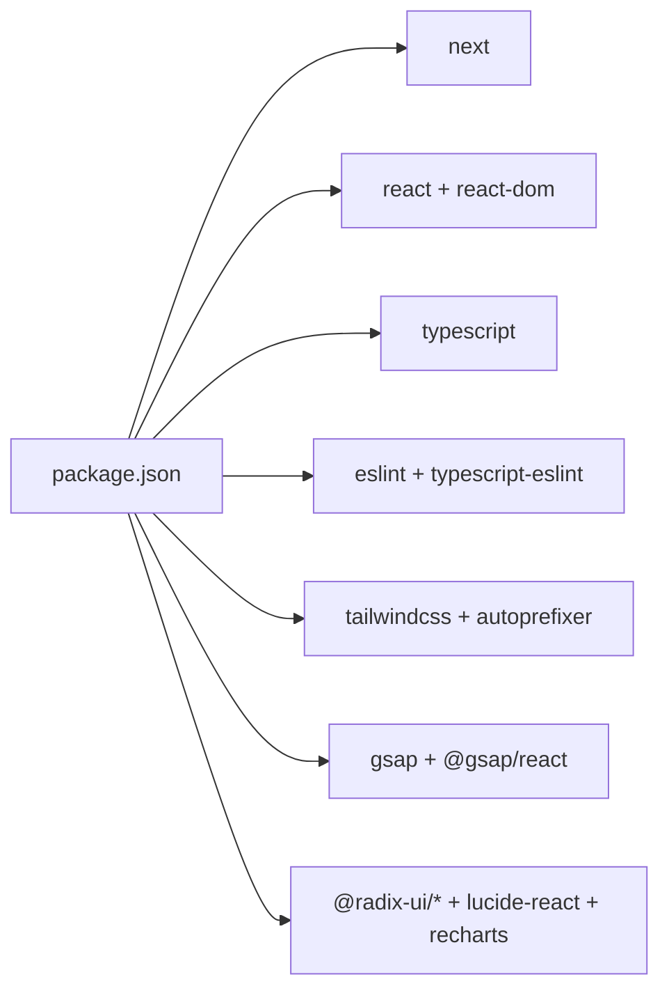

# Getting Started

<cite>
**Referenced Files in This Document**
- [package.json](file://package.json)
- [pnpm-workspace.yaml](file://pnpm-workspace.yaml)
- [next.config.js](file://next.config.js)
- [tsconfig.json](file://tsconfig.json)
- [tailwind.config.js](file://tailwind.config.js)
- [postcss.config.js](file://postcss.config.js)
- [eslint.config.js](file://eslint.config.js)
- [README.md](file://README.md)
- [QUICK_START.md](file://QUICK_START.md)
- [OPTIMIZATION_CHECKLIST.md](file://OPTIMIZATION_CHECKLIST.md)
- [app/layout.tsx](file://app/layout.tsx)
- [src/components/Navbar.tsx](file://src/components/Navbar.tsx)
- [src/sections/HeroSequence.tsx](file://src/sections/HeroSequence.tsx)
- [src/lib/gsapManager.ts](file://src/lib/gsapManager.ts)
- [src/components/ErrorBoundary.tsx](file://src/components/ErrorBoundary.tsx)
</cite>

## Table of Contents
1. [Introduction](#introduction)
2. [Project Structure](#project-structure)
3. [Core Components](#core-components)
4. [Architecture Overview](#architecture-overview)
5. [Detailed Component Analysis](#detailed-component-analysis)
6. [Dependency Analysis](#dependency-analysis)
7. [Performance Considerations](#performance-considerations)
8. [Troubleshooting Guide](#troubleshooting-guide)
9. [Conclusion](#conclusion)
10. [Appendices](#appendices)

## Introduction
This guide helps you set up, develop, build, and deploy the Digital Addis website locally. It covers prerequisites, installation, development workflow, build and production preparation, and troubleshooting. The project is a Next.js application configured with TypeScript, Tailwind CSS, and performance-focused tooling.

## Project Structure
The project follows a Next.js App Router structure with a clear separation of app routes, shared components, sections, and utilities. Key areas:
- app/: Application routes and metadata
- src/components/: Shared UI components and providers
- src/sections/: Feature-rich page sections
- src/lib/: Utilities and managers (e.g., GSAP)
- Public assets: Static assets under public/

**Diagram sources**
- [app/layout.tsx:164-216](file://app/layout.tsx#L164-L216)
- [src/components/Navbar.tsx:1-209](file://src/components/Navbar.tsx#L1-L209)
- [src/sections/HeroSequence.tsx:1-377](file://src/sections/HeroSequence.tsx#L1-L377)
- [src/lib/gsapManager.ts:1-128](file://src/lib/gsapManager.ts#L1-L128)
- [next.config.js:1-101](file://next.config.js#L1-L101)
- [tailwind.config.js:1-112](file://tailwind.config.js#L1-L112)
- [postcss.config.js:1-7](file://postcss.config.js#L1-L7)
- [tsconfig.json:1-69](file://tsconfig.json#L1-L69)

**Section sources**
- [app/layout.tsx:1-217](file://app/layout.tsx#L1-L217)
- [src/components/Navbar.tsx:1-209](file://src/components/Navbar.tsx#L1-L209)
- [src/sections/HeroSequence.tsx:1-377](file://src/sections/HeroSequence.tsx#L1-L377)
- [src/lib/gsapManager.ts:1-128](file://src/lib/gsapManager.ts#L1-L128)
- [next.config.js:1-101](file://next.config.js#L1-L101)
- [tailwind.config.js:1-112](file://tailwind.config.js#L1-L112)
- [postcss.config.js:1-7](file://postcss.config.js#L1-L7)
- [tsconfig.json:1-69](file://tsconfig.json#L1-L69)

## Core Components
- Root layout and metadata: Defines site metadata, viewport, structured data, and providers.
- Navigation: Responsive navbar with memoization and accessibility.
- Hero animation: Canvas-based animated hero with progressive image loading and GSAP-driven scroll-triggered animation.
- Error boundary: Graceful error handling at the layout level.
- GSAP manager: Centralized context and ScrollTrigger lifecycle management to avoid memory leaks.

**Section sources**
- [app/layout.tsx:20-216](file://app/layout.tsx#L20-L216)
- [src/components/Navbar.tsx:39-209](file://src/components/Navbar.tsx#L39-L209)
- [src/sections/HeroSequence.tsx:43-281](file://src/sections/HeroSequence.tsx#L43-L281)
- [src/components/ErrorBoundary.tsx:16-60](file://src/components/ErrorBoundary.tsx#L16-L60)
- [src/lib/gsapManager.ts:10-125](file://src/lib/gsapManager.ts#L10-L125)

## Architecture Overview
The application is a Next.js app with:
- TypeScript compiler configuration
- Tailwind CSS with PostCSS
- ESLint for code quality
- Performance-first Next.js configuration (image optimization, experimental optimizations, headers, on-demand entries)
- Centralized GSAP management for animations

**Diagram sources**
- [app/layout.tsx:164-216](file://app/layout.tsx#L164-L216)
- [src/components/Navbar.tsx:1-209](file://src/components/Navbar.tsx#L1-L209)
- [src/sections/HeroSequence.tsx:1-377](file://src/sections/HeroSequence.tsx#L1-L377)
- [src/lib/gsapManager.ts:1-128](file://src/lib/gsapManager.ts#L1-L128)
- [tsconfig.json:1-69](file://tsconfig.json#L1-L69)
- [tailwind.config.js:1-112](file://tailwind.config.js#L1-L112)
- [postcss.config.js:1-7](file://postcss.config.js#L1-L7)
- [next.config.js:1-101](file://next.config.js#L1-L101)
- [eslint.config.js:1-24](file://eslint.config.js#L1-L24)

## Detailed Component Analysis

### Development Environment Setup
- Node.js and package manager
  - Use Node.js LTS as recommended by Next.js. The project specifies modern runtime features and Next.js 16 capabilities.
  - The repository includes pnpm workspace configuration and lock files, indicating pnpm is the preferred package manager.
- Install dependencies
  - Use pnpm to install dependencies as defined in the workspace configuration and lock files.
- Initialize environment
  - There is no .env file in the repository; environment variables are not required for basic local development.

**Section sources**
- [pnpm-workspace.yaml:1-4](file://pnpm-workspace.yaml#L1-L4)
- [package.json:1-87](file://package.json#L1-L87)
- [README.md:1-74](file://README.md#L1-L74)

### Local Development Workflow
- Start the development server
  - Run the dev script to launch Next.js in development mode with fast refresh.
- Hot reload
  - Next.js provides file-based hot module replacement; editing components updates the browser without full reloads.
- Project orientation
  - app/: Routes and metadata
  - src/components/: Shared UI components and providers
  - src/sections/: Feature sections (e.g., HeroSequence)
  - src/lib/: Managers and utilities (e.g., gsapManager)

**Diagram sources**
- [package.json:6-11](file://package.json#L6-L11)
- [next.config.js:1-101](file://next.config.js#L1-L101)

**Section sources**
- [package.json:6-11](file://package.json#L6-L11)
- [next.config.js:1-101](file://next.config.js#L1-L101)

### Build Process and Production Preparation
- Build
  - Run the build script to compile the application for production.
- Start production server
  - Run the start script to serve the built application.
- Lighthouse and performance checks
  - Use Lighthouse to validate performance targets and ensure Core Web Vitals thresholds are met.
- Optimization highlights
  - Image optimization with modern formats and aggressive caching
  - On-demand entries for faster cold starts
  - Experimental package imports optimization
  - Security headers and cache policies

**Diagram sources**
- [package.json:8-10](file://package.json#L8-L10)
- [next.config.js:5-98](file://next.config.js#L5-L98)
- [QUICK_START.md:209-239](file://QUICK_START.md#L209-L239)

**Section sources**
- [package.json:8-10](file://package.json#L8-L10)
- [next.config.js:5-98](file://next.config.js#L5-L98)
- [QUICK_START.md:209-239](file://QUICK_START.md#L209-L239)

### Quick Start Examples
- Start development
  - Run the dev script to launch the development server.
- Build and preview
  - Build the project and start the production server to preview the build locally.
- Validate performance
  - Use Lighthouse to audit performance and compare against target thresholds.

**Section sources**
- [package.json:6-11](file://package.json#L6-L11)
- [QUICK_START.md:216-227](file://QUICK_START.md#L216-L227)

## Dependency Analysis
Key runtime and toolchain dependencies:
- Next.js framework and related packages
- React and React DOM
- Tailwind CSS and PostCSS
- TypeScript and ESLint
- GSAP with ScrollTrigger for animations
- UI primitives and icons
- Utility libraries for animations and charts

**Diagram sources**
- [package.json:12-85](file://package.json#L12-L85)

**Section sources**
- [package.json:12-85](file://package.json#L12-L85)

## Performance Considerations
- Image optimization
  - Remote image patterns, formats, caching TTL, and device sizes configured for optimal delivery.
- Memory and animation hygiene
  - Centralized GSAP context management prevents memory leaks and ensures cleanup.
- Build-time optimizations
  - Experimental package imports optimization and on-demand entries reduce cold start times.
- Accessibility and monitoring
  - Error boundaries, reduced motion support, and Web Vitals tracking hooks.

**Section sources**
- [next.config.js:10-49](file://next.config.js#L10-L49)
- [src/lib/gsapManager.ts:10-125](file://src/lib/gsapManager.ts#L10-L125)
- [OPTIMIZATION_CHECKLIST.md:1-461](file://OPTIMIZATION_CHECKLIST.md#L1-L461)

## Troubleshooting Guide
- Development server fails to start
  - Ensure Node.js LTS is installed and pnpm is available.
  - Clear node_modules and reinstall dependencies if needed.
- Hot reload not working
  - Confirm the dev script runs and file edits trigger updates.
- Build errors
  - Run the build script and inspect logs; ensure TypeScript compiles without errors.
- Performance regressions
  - Use Lighthouse and DevTools Performance panel to identify long tasks and memory growth.
  - Validate image loading and animation behavior with the provided hooks and components.
- Error boundaries
  - The layout wraps children in an error boundary; if errors persist, inspect the console and error logs.

**Section sources**
- [package.json:6-11](file://package.json#L6-L11)
- [next.config.js:54-97](file://next.config.js#L54-L97)
- [src/components/ErrorBoundary.tsx:25-32](file://src/components/ErrorBoundary.tsx#L25-L32)
- [QUICK_START.md:101-128](file://QUICK_START.md#L101-L128)

## Conclusion
You now have the essentials to install dependencies, run the development server, build for production, and validate performance. Use the provided scripts, configuration, and components to maintain a fast, accessible, and maintainable site.

## Appendices

### Prerequisites
- Node.js LTS recommended by Next.js
- pnpm recommended by repository configuration
- Optional: IDE with TypeScript and ESLint extensions

**Section sources**
- [pnpm-workspace.yaml:1-4](file://pnpm-workspace.yaml#L1-L4)
- [README.md:1-74](file://README.md#L1-L74)

### System Requirements and Browser Compatibility
- Latest versions of modern browsers
- Mobile-first responsive design with accessibility hooks

**Section sources**
- [OPTIMIZATION_CHECKLIST.md:260-269](file://OPTIMIZATION_CHECKLIST.md#L260-L269)

### IDE Recommendations
- VS Code with extensions for TypeScript, ESLint, Tailwind CSS IntelliSense, and Prettier
- Recommended settings: strict TypeScript, format on save, and ESLint on save

[No sources needed since this section provides general guidance]