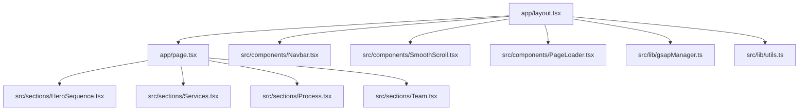
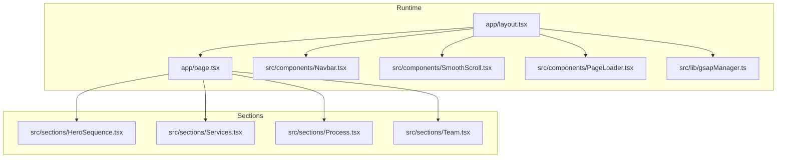
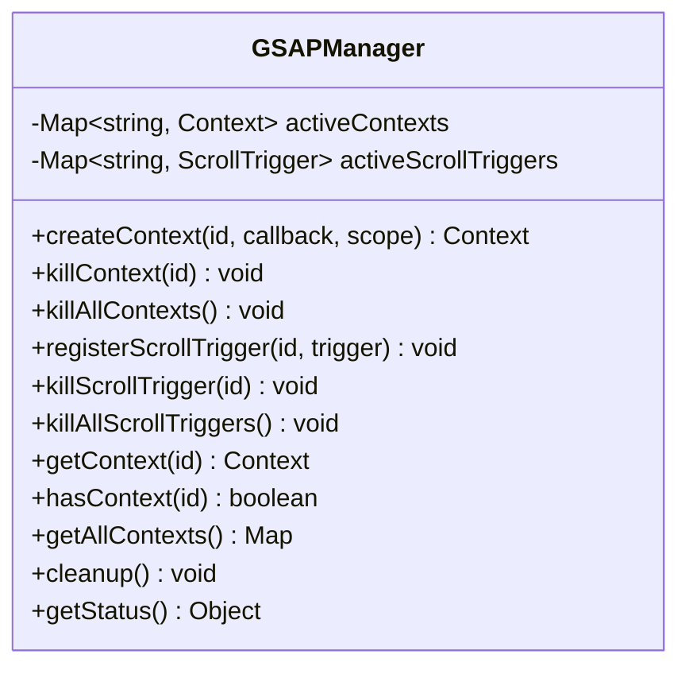
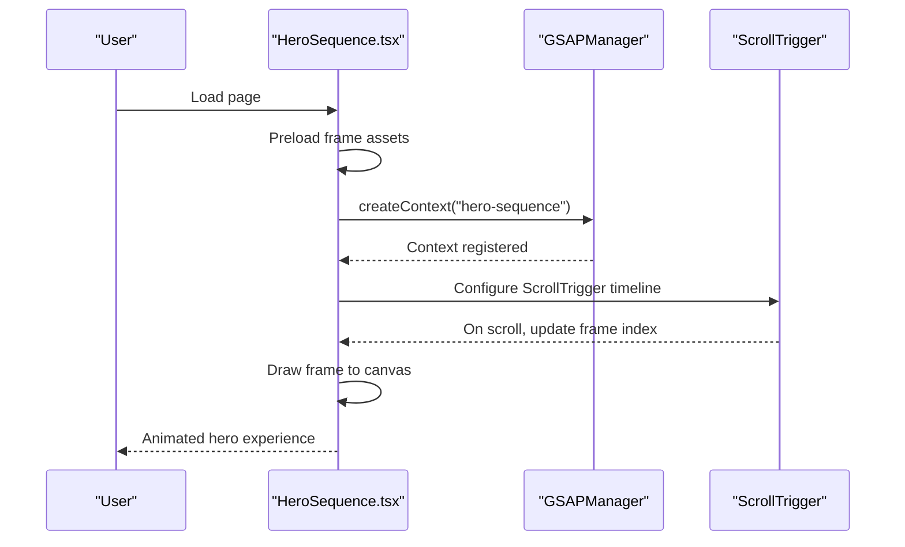
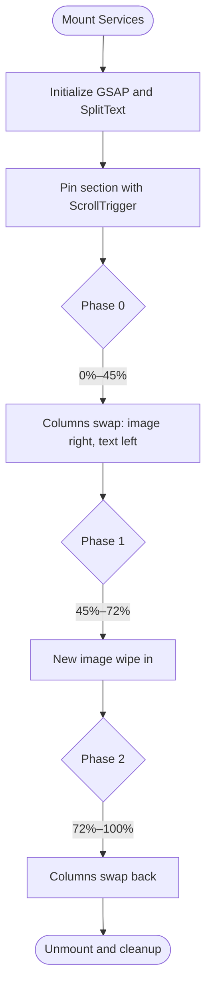
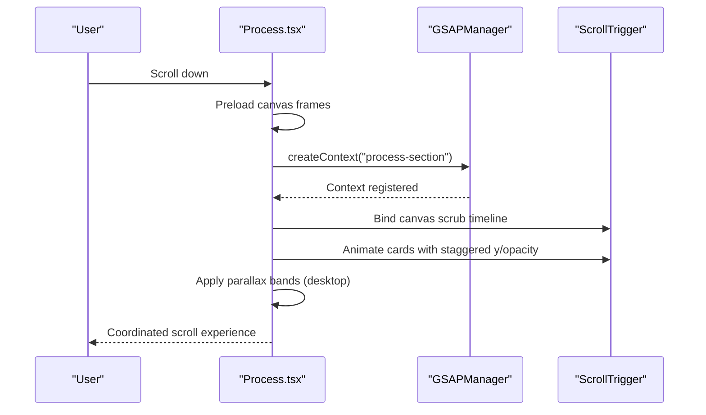
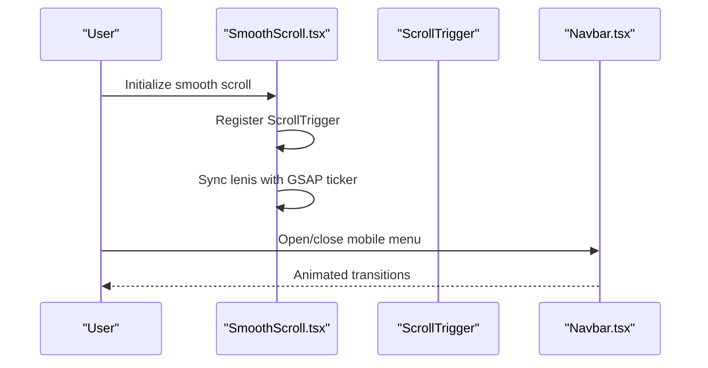
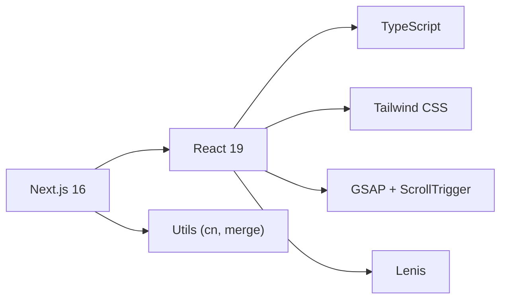

# Project Overview

<cite>
**Referenced Files in This Document**
- [README.md](file://README.md)
- [package.json](file://package.json)
- [next.config.js](file://next.config.js)
- [tailwind.config.js](file://tailwind.config.js)
- [app/layout.tsx](file://app/layout.tsx)
- [app/page.tsx](file://app/page.tsx)
- [src/lib/gsapManager.ts](file://src/lib/gsapManager.ts)
- [src/lib/utils.ts](file://src/lib/utils.ts)
- [src/components/Navbar.tsx](file://src/components/Navbar.tsx)
- [src/components/SmoothScroll.tsx](file://src/components/SmoothScroll.tsx)
- [src/components/PageLoader.tsx](file://src/components/PageLoader.tsx)
- [src/sections/HeroSequence.tsx](file://src/sections/HeroSequence.tsx)
- [src/sections/Services.tsx](file://src/sections/Services.tsx)
- [src/sections/Process.tsx](file://src/sections/Process.tsx)
- [src/sections/Team.tsx](file://src/sections/Team.tsx)
</cite>

## Table of Contents
1. [Introduction](#introduction)
2. [Project Structure](#project-structure)
3. [Core Components](#core-components)
4. [Architecture Overview](#architecture-overview)
5. [Detailed Component Analysis](#detailed-component-analysis)
6. [Dependency Analysis](#dependency-analysis)
7. [Performance Considerations](#performance-considerations)
8. [Troubleshooting Guide](#troubleshooting-guide)
9. [Conclusion](#conclusion)

## Introduction
Digital Addis is Ethiopia’s premier digital agency dedicated to showcasing digital transformation services, custom software development, cybersecurity, and cloud solutions. The website serves as a flagship digital asset that demonstrates the agency’s expertise, aesthetic sensibility, and technical capability through a modern, immersive web experience built with Next.js 16, React 19, TypeScript, GSAP animations, and Tailwind CSS.

The site’s mission is to communicate the agency’s value proposition clearly: innovation, security, and transformation. It targets decision-makers, entrepreneurs, and enterprises seeking a forward-thinking partner for digital growth, while highlighting the agency’s portfolio, process, and team.

Key differentiators:
- Immersive storytelling with scroll-driven animations and canvas sequences
- Performance-first architecture with lazy loading, optimized image delivery, and smooth scrolling
- Strong accessibility and SEO foundations with structured data and metadata
- Consistent design tokens and theme support for a cohesive brand experience

Scope and goals:
- Showcase services and outcomes with compelling visuals and copy
- Educate visitors on the digital transformation process
- Demonstrate technical excellence and attention to UX through advanced animations and interactions
- Maintain high performance and accessibility standards

Scope limitations:
- The site focuses on awareness and conversion funnels; it does not host client portals or internal tools
- Content is curated for public consumption and brand storytelling

## Project Structure
The project follows a modular, feature-oriented structure aligned with Next.js App Router conventions. The application is organized into:
- app/: Route handlers, pages, and shared layouts
- src/components/: Reusable UI primitives and providers
- src/sections/: Feature-rich, scroll-triggered page sections
- src/lib/: Utility libraries and animation managers
- Public assets: Images, fonts, and manifests

**Diagram sources**
- [app/layout.tsx:164-216](file://app/layout.tsx#L164-L216)
- [app/page.tsx:102-165](file://app/page.tsx#L102-L165)
- [src/sections/HeroSequence.tsx:43-376](file://src/sections/HeroSequence.tsx#L43-L376)
- [src/sections/Services.tsx:72-324](file://src/sections/Services.tsx#L72-L324)
- [src/sections/Process.tsx:53-400](file://src/sections/Process.tsx#L53-L400)
- [src/sections/Team.tsx:10-109](file://src/sections/Team.tsx#L10-L109)
- [src/components/Navbar.tsx:39-209](file://src/components/Navbar.tsx#L39-L209)
- [src/components/SmoothScroll.tsx:8-46](file://src/components/SmoothScroll.tsx#L8-L46)
- [src/components/PageLoader.tsx:6-98](file://src/components/PageLoader.tsx#L6-L98)
- [src/lib/gsapManager.ts:10-128](file://src/lib/gsapManager.ts#L10-L128)
- [src/lib/utils.ts:4-7](file://src/lib/utils.ts#L4-L7)

**Section sources**
- [app/layout.tsx:164-216](file://app/layout.tsx#L164-L216)
- [app/page.tsx:102-165](file://app/page.tsx#L102-L165)

## Core Components
- Application shell and metadata: The root layout configures SEO, structured data, theme provider, smooth scrolling, and page loader.
- Navigation: A responsive, animated navbar with theme toggle and mobile menu.
- Hero sequence: A scroll-driven canvas animation introducing the brand story with layered imagery and progress feedback.
- Services showcase: A pinned, scroll-triggered section that swaps imagery and content to present offerings.
- Process narrative: A desktop canvas sequence with cards that guide users through the agency’s methodology.
- Team presentation: A responsive bento grid with animated reveals and brand-aligned visuals.
- Animation orchestration: A centralized GSAP manager to prevent memory leaks and coordinate lifecycle events.
- Utilities: A Tailwind merge utility and shared class composition helper.

Practical examples of services and capabilities:
- Custom software development: Highlighted through UI/UX and web design sections.
- Digital marketing: Communicated via service copy and animated transitions.
- Mobile app development: Presented alongside web experiences with unified visuals.
- Cybersecurity and cloud solutions: Positioned as foundational pillars of transformation, supported by performance and security headers.

**Section sources**
- [app/layout.tsx:36-160](file://app/layout.tsx#L36-L160)
- [src/components/Navbar.tsx:39-209](file://src/components/Navbar.tsx#L39-L209)
- [src/sections/HeroSequence.tsx:43-376](file://src/sections/HeroSequence.tsx#L43-L376)
- [src/sections/Services.tsx:72-324](file://src/sections/Services.tsx#L72-L324)
- [src/sections/Process.tsx:53-400](file://src/sections/Process.tsx#L53-L400)
- [src/sections/Team.tsx:10-109](file://src/sections/Team.tsx#L10-L109)
- [src/lib/gsapManager.ts:10-128](file://src/lib/gsapManager.ts#L10-L128)
- [src/lib/utils.ts:4-7](file://src/lib/utils.ts#L4-L7)

## Architecture Overview
The architecture emphasizes:
- Progressive enhancement: Sections are progressively enhanced with animations and interactions.
- Performance-first routing: Next.js App Router with dynamic imports and skeleton loaders.
- Animation orchestration: GSAP timelines coordinated with ScrollTrigger and a centralized manager.
- Theming and design system: Tailwind CSS with theme tokens and a theme provider.
- Accessibility and SEO: Semantic markup, ARIA attributes, structured data, and metadata.

**Diagram sources**
- [app/layout.tsx:164-216](file://app/layout.tsx#L164-L216)
- [app/page.tsx:102-165](file://app/page.tsx#L102-L165)
- [src/sections/HeroSequence.tsx:43-376](file://src/sections/HeroSequence.tsx#L43-L376)
- [src/sections/Services.tsx:72-324](file://src/sections/Services.tsx#L72-L324)
- [src/sections/Process.tsx:53-400](file://src/sections/Process.tsx#L53-L400)
- [src/sections/Team.tsx:10-109](file://src/sections/Team.tsx#L10-L109)
- [src/components/Navbar.tsx:39-209](file://src/components/Navbar.tsx#L39-L209)
- [src/components/SmoothScroll.tsx:8-46](file://src/components/SmoothScroll.tsx#L8-L46)
- [src/components/PageLoader.tsx:6-98](file://src/components/PageLoader.tsx#L6-L98)
- [src/lib/gsapManager.ts:10-128](file://src/lib/gsapManager.ts#L10-L128)

## Detailed Component Analysis

### Animation Orchestration with GSAP Manager
The GSAP manager centralizes context creation and lifecycle management to avoid memory leaks and ensure proper cleanup during navigation and resizing.

**Diagram sources**
- [src/lib/gsapManager.ts:10-128](file://src/lib/gsapManager.ts#L10-L128)

**Section sources**
- [src/lib/gsapManager.ts:10-128](file://src/lib/gsapManager.ts#L10-L128)

### Hero Sequence: Scroll-Driven Canvas Animation
The hero section uses a canvas-based animation sequence synchronized with scroll. It preloads frames, manages priority loading, and coordinates GSAP timelines with ScrollTrigger for a polished reveal.

**Diagram sources**
- [src/sections/HeroSequence.tsx:43-376](file://src/sections/HeroSequence.tsx#L43-L376)
- [src/lib/gsapManager.ts:184-281](file://src/lib/gsapManager.ts#L184-L281)

**Section sources**
- [src/sections/HeroSequence.tsx:43-376](file://src/sections/HeroSequence.tsx#L43-L376)

### Services Showcase: Pinned Scroll with Image Wipes
The services section pins content while swapping imagery and text using clip-path animations and ScrollTrigger. It leverages a split-text technique for typographic effects and a GSAP manager for lifecycle control.

**Diagram sources**
- [src/sections/Services.tsx:117-193](file://src/sections/Services.tsx#L117-L193)

**Section sources**
- [src/sections/Services.tsx:72-324](file://src/sections/Services.tsx#L72-L324)

### Process Narrative: Canvas Sequence and Card Reveal
The process section combines a desktop canvas sequence with animated cards. It uses ScrollTrigger to scrub through frames and reveal cards as users scroll, with parallax bands for depth.

**Diagram sources**
- [src/sections/Process.tsx:150-218](file://src/sections/Process.tsx#L150-L218)

**Section sources**
- [src/sections/Process.tsx:53-400](file://src/sections/Process.tsx#L53-L400)

### Team Presentation: Responsive Bento Grid with Reveal
The team section uses a responsive grid layout with animated reveals triggered by ScrollTrigger. It balances typography, imagery, and brand accents to communicate culture and values.

**Section sources**
- [src/sections/Team.tsx:10-109](file://src/sections/Team.tsx#L10-L109)

### Navigation and Smooth Scrolling
The navbar integrates with the theme provider and supports mobile responsiveness. Smooth scrolling is orchestrated via Lenis and synchronized with GSAP’s ticker to ensure consistent animation timing.

**Diagram sources**
- [src/components/SmoothScroll.tsx:8-46](file://src/components/SmoothScroll.tsx#L8-L46)
- [src/components/Navbar.tsx:39-209](file://src/components/Navbar.tsx#L39-L209)

**Section sources**
- [src/components/SmoothScroll.tsx:8-46](file://src/components/SmoothScroll.tsx#L8-L46)
- [src/components/Navbar.tsx:39-209](file://src/components/Navbar.tsx#L39-L209)

## Dependency Analysis
Technology stack highlights:
- Next.js 16: App Router, dynamic imports, and experimental optimizations
- React 19: Concurrent features and improved rendering
- TypeScript: Strict typing across components and utilities
- GSAP + ScrollTrigger: Advanced scroll-driven animations
- Tailwind CSS: Utility-first styling with theme tokens and animations
- Lenis: Smooth scroll integration with GSAP

**Diagram sources**
- [package.json:12-66](file://package.json#L12-L66)
- [tailwind.config.js:4-112](file://tailwind.config.js#L4-L112)
- [next.config.js:2-101](file://next.config.js#L2-L101)

**Section sources**
- [package.json:12-66](file://package.json#L12-L66)
- [tailwind.config.js:4-112](file://tailwind.config.js#L4-L112)
- [next.config.js:2-101](file://next.config.js#L2-L101)

## Performance Considerations
- Image optimization: Next.js image optimization with modern formats (AVIF/WebP), aggressive caching, and device sizes tailored for responsiveness.
- Lazy loading: Dynamic imports with skeleton loaders for below-the-fold sections to reduce initial payload.
- Animation performance: GSAP ScrollTrigger with fastScrollEnd and requestIdleCallback-based loading; centralized manager prevents leaks.
- Smooth scrolling: Lenis synchronized with GSAP ticker to avoid conflicts and maintain frame stability.
- Security headers: Hardening headers configured at the framework level for XSS, MIME sniffing, framing, and referrer policies.
- Theme and CSS: Tailwind utilities and CSS animations kept minimal; theme tokens reduce duplication.

[No sources needed since this section provides general guidance]

## Troubleshooting Guide
Common issues and resolutions:
- Animations not triggering: Verify ScrollTrigger initialization and that sections are mounted before timelines are bound. Ensure the GSAP manager context is created and cleaned up on unmount.
- Canvas not drawing frames: Confirm frame paths and preload logic; check that the canvas size matches the window and that drawFrame is invoked after images are loaded.
- Scroll jank or conflicts: Ensure Lenis is synchronized with GSAP ticker and that lag smoothing is disabled for GSAP to prevent conflicts.
- Mobile menu not closing: Confirm event listeners and resize handlers are attached and removed on unmount.
- Theme flicker: Use the theme provider with disableTransitionOnChange to avoid FOUC during hydration.

**Section sources**
- [src/lib/gsapManager.ts:184-281](file://src/lib/gsapManager.ts#L184-L281)
- [src/sections/HeroSequence.tsx:83-162](file://src/sections/HeroSequence.tsx#L83-L162)
- [src/components/SmoothScroll.tsx:8-46](file://src/components/SmoothScroll.tsx#L8-L46)
- [src/components/Navbar.tsx:44-79](file://src/components/Navbar.tsx#L44-L79)
- [app/layout.tsx:202-212](file://app/layout.tsx#L202-L212)

## Conclusion
Digital Addis’ website is a performance-driven showcase of digital transformation services, built with a modern stack and immersive animations. Its architecture balances technical excellence with strong accessibility and SEO practices, while the animation system communicates the agency’s expertise and attention to detail. The project’s scope remains focused on awareness and conversion, with clear scope limitations and a robust foundation for future enhancements.