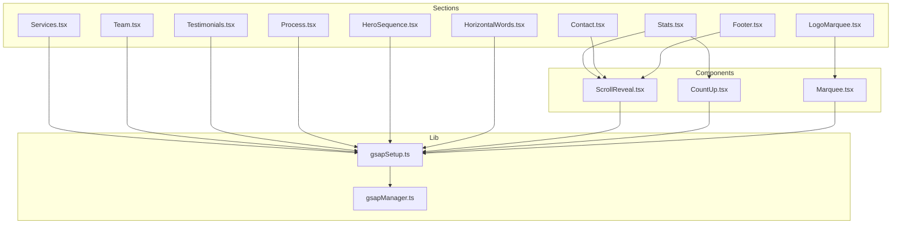
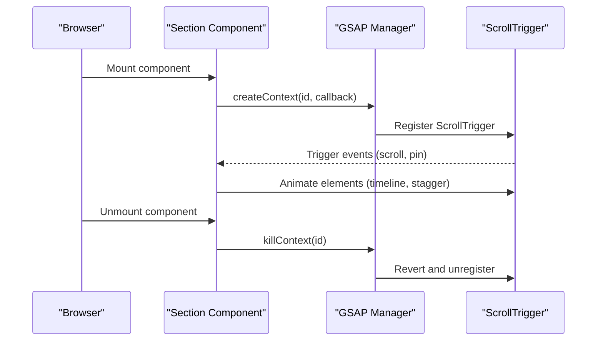
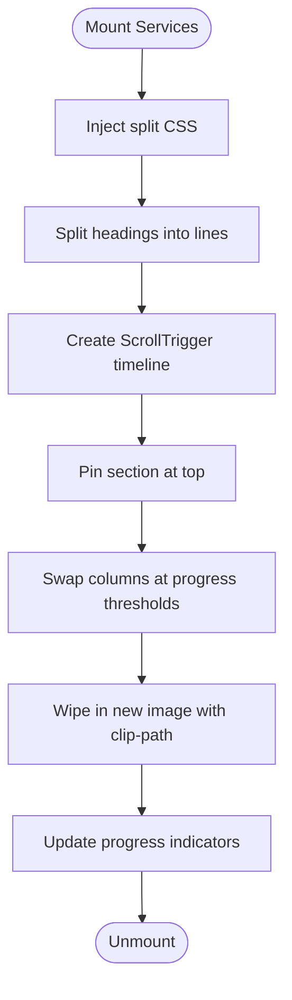
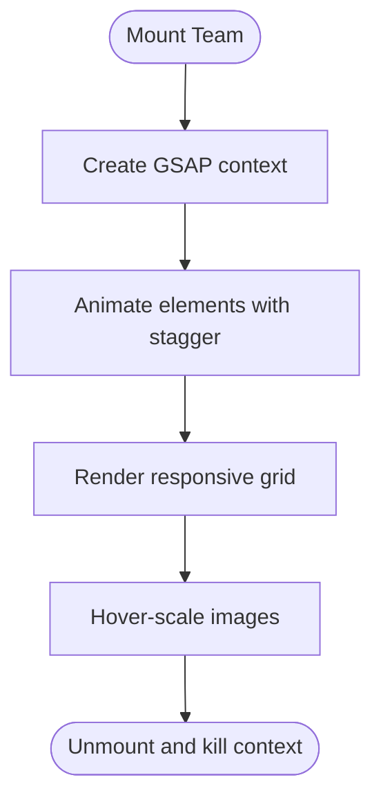
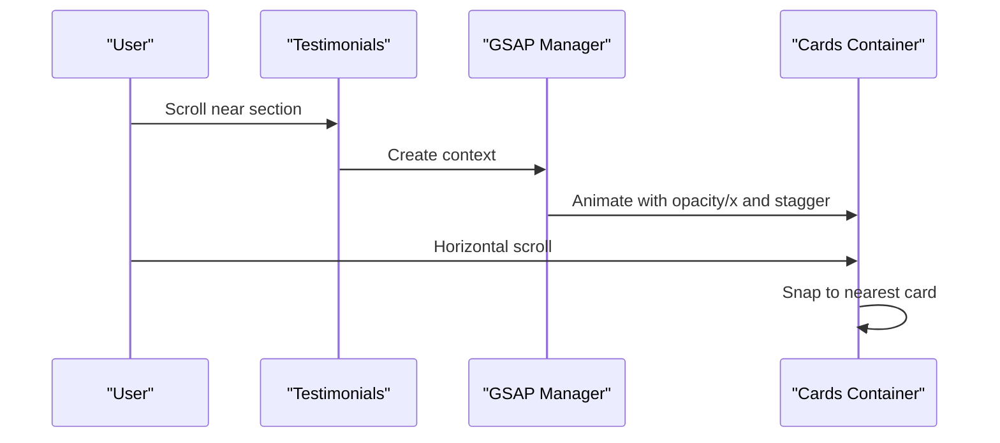
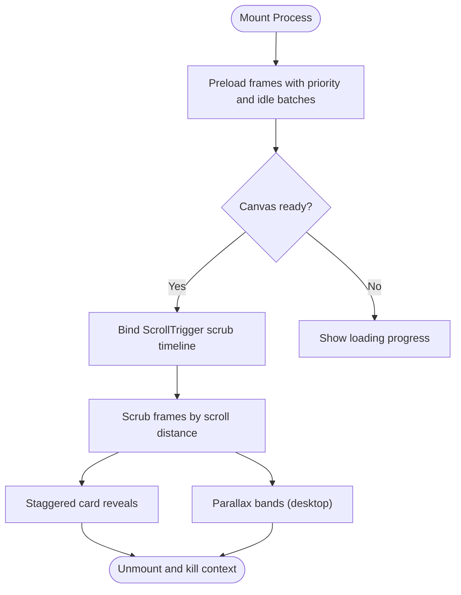
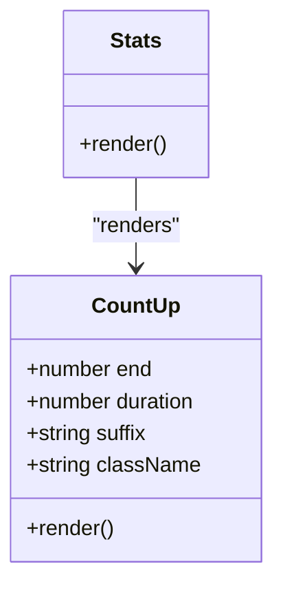
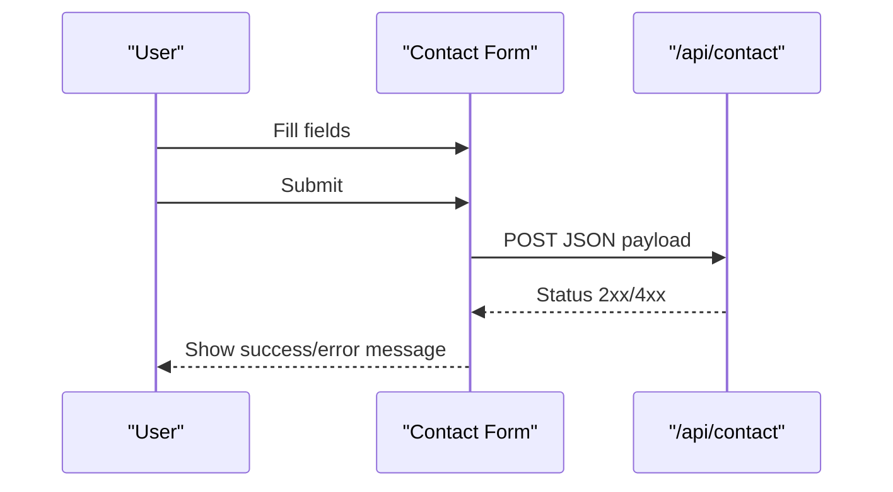
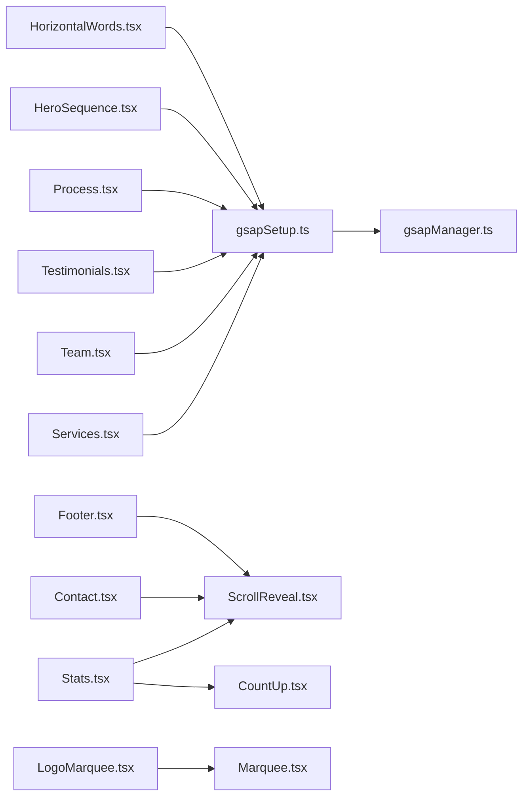

# Section Components

<cite>
**Referenced Files in This Document**
- [Services.tsx](file://src/sections/Services.tsx)
- [Team.tsx](file://src/sections/Team.tsx)
- [Testimonials.tsx](file://src/sections/Testimonials.tsx)
- [Process.tsx](file://src/sections/Process.tsx)
- [Stats.tsx](file://src/sections/Stats.tsx)
- [Contact.tsx](file://src/sections/Contact.tsx)
- [Footer.tsx](file://src/sections/Footer.tsx)
- [HeroSequence.tsx](file://src/sections/HeroSequence.tsx)
- [HorizontalWords.tsx](file://src/sections/HorizontalWords.tsx)
- [LogoMarquee.tsx](file://src/sections/LogoMarquee.tsx)
- [CountUp.tsx](file://src/components/CountUp.tsx)
- [ScrollReveal.tsx](file://src/components/ScrollReveal.tsx)
- [Marquee.tsx](file://src/components/Marquee.tsx)
- [gsapManager.ts](file://src/lib/gsapManager.ts)
- [gsapSetup.ts](file://src/lib/gsapSetup.ts)
</cite>

## Table of Contents
1. [Introduction](#introduction)
2. [Project Structure](#project-structure)
3. [Core Components](#core-components)
4. [Architecture Overview](#architecture-overview)
5. [Detailed Component Analysis](#detailed-component-analysis)
6. [Dependency Analysis](#dependency-analysis)
7. [Performance Considerations](#performance-considerations)
8. [Troubleshooting Guide](#troubleshooting-guide)
9. [Conclusion](#conclusion)
10. [Appendices](#appendices)

## Introduction
This document explains the section components that compose the Digital Addis website pages. It focuses on the services showcase, team profiles, testimonials carousel, process workflow, statistics display, contact form, and footer implementation. For each section, you will find component structure, prop interfaces, data requirements, integration patterns, responsive design, accessibility, performance optimizations, customization options, content management integration, dynamic content handling, SEO considerations, social media integration, and cross-platform compatibility.

## Project Structure
The sections are implemented as standalone React components under the src/sections directory. They integrate with reusable UI primitives and animation utilities located under src/components and src/lib. The animation engine is powered by GSAP with centralized context management to avoid memory leaks and ensure clean lifecycle control.

**Diagram sources**
- [Services.tsx:1-320](file://src/sections/Services.tsx#L1-L320)
- [Team.tsx:1-107](file://src/sections/Team.tsx#L1-L107)
- [Testimonials.tsx:1-166](file://src/sections/Testimonials.tsx#L1-L166)
- [Process.tsx:1-397](file://src/sections/Process.tsx#L1-L397)
- [Stats.tsx:1-49](file://src/sections/Stats.tsx#L1-L49)
- [Contact.tsx:1-203](file://src/sections/Contact.tsx#L1-L203)
- [Footer.tsx:1-158](file://src/sections/Footer.tsx#L1-L158)
- [HeroSequence.tsx:1-373](file://src/sections/HeroSequence.tsx#L1-L373)
- [HorizontalWords.tsx:1-173](file://src/sections/HorizontalWords.tsx#L1-L173)
- [LogoMarquee.tsx:1-53](file://src/sections/LogoMarquee.tsx#L1-L53)
- [ScrollReveal.tsx:1-65](file://src/components/ScrollReveal.tsx#L1-L65)
- [CountUp.tsx:1-60](file://src/components/CountUp.tsx#L1-L60)
- [Marquee.tsx:1-36](file://src/components/Marquee.tsx#L1-L36)
- [gsapSetup.ts:1-11](file://src/lib/gsapSetup.ts#L1-L11)
- [gsapManager.ts:1-128](file://src/lib/gsapManager.ts#L1-L128)

**Section sources**
- [Services.tsx:1-320](file://src/sections/Services.tsx#L1-L320)
- [Team.tsx:1-107](file://src/sections/Team.tsx#L1-L107)
- [Testimonials.tsx:1-166](file://src/sections/Testimonials.tsx#L1-L166)
- [Process.tsx:1-397](file://src/sections/Process.tsx#L1-L397)
- [Stats.tsx:1-49](file://src/sections/Stats.tsx#L1-L49)
- [Contact.tsx:1-203](file://src/sections/Contact.tsx#L1-L203)
- [Footer.tsx:1-158](file://src/sections/Footer.tsx#L1-L158)
- [HeroSequence.tsx:1-373](file://src/sections/HeroSequence.tsx#L1-L373)
- [HorizontalWords.tsx:1-173](file://src/sections/HorizontalWords.tsx#L1-L173)
- [LogoMarquee.tsx:1-53](file://src/sections/LogoMarquee.tsx#L1-L53)
- [ScrollReveal.tsx:1-65](file://src/components/ScrollReveal.tsx#L1-L65)
- [CountUp.tsx:1-60](file://src/components/CountUp.tsx#L1-L60)
- [Marquee.tsx:1-36](file://src/components/Marquee.tsx#L1-L36)
- [gsapSetup.ts:1-11](file://src/lib/gsapSetup.ts#L1-L11)
- [gsapManager.ts:1-128](file://src/lib/gsapManager.ts#L1-L128)

## Core Components
This section summarizes the primary section components and their roles:

- Services: A full-viewport, pinned, animated showcase of services with split-text animations, image wipe transitions, and progress indicators.
- Team: A responsive, bento-style team presentation with staggered reveals and interactive hover effects.
- Testimonials: A horizontally scrollable, snap-enabled carousel of client testimonials with video-play placeholders and color themes per card.
- Process: A complex, canvas-based assembly sequence with 192+ frames, scroll-triggered scrubbing, and layered notebook cards representing steps.
- Stats: A grid of animated counters with scroll-triggered counting and green-highlighted cards.
- Contact: A dual-column layout with a CTA card and a styled form, integrated with a Next.js API route for submissions.
- Footer: A multi-column footer with navigation, services, location, and social links, plus a subtle watermark.

**Section sources**
- [Services.tsx:67-320](file://src/sections/Services.tsx#L67-L320)
- [Team.tsx:8-107](file://src/sections/Team.tsx#L8-L107)
- [Testimonials.tsx:52-166](file://src/sections/Testimonials.tsx#L52-L166)
- [Process.tsx:48-397](file://src/sections/Process.tsx#L48-L397)
- [Stats.tsx:11-49](file://src/sections/Stats.tsx#L11-L49)
- [Contact.tsx:17-203](file://src/sections/Contact.tsx#L17-L203)
- [Footer.tsx:45-158](file://src/sections/Footer.tsx#L45-L158)

## Architecture Overview
The sections rely on a consistent pattern:
- Client-side rendering with React hooks for state and effects.
- GSAP ScrollTrigger for scroll-linked animations and pinning.
- Centralized GSAP context management to prevent memory leaks.
- Reusable UI primitives for forms, typography, and motion.

**Diagram sources**
- [gsapManager.ts:10-47](file://src/lib/gsapManager.ts#L10-L47)
- [gsapSetup.ts:6-8](file://src/lib/gsapSetup.ts#L6-L8)
- [ScrollReveal.tsx:24-53](file://src/components/ScrollReveal.tsx#L24-L53)
- [CountUp.tsx:23-51](file://src/components/CountUp.tsx#L23-L51)

**Section sources**
- [gsapManager.ts:1-128](file://src/lib/gsapManager.ts#L1-L128)
- [gsapSetup.ts:1-11](file://src/lib/gsapSetup.ts#L1-L11)
- [ScrollReveal.tsx:1-65](file://src/components/ScrollReveal.tsx#L1-L65)
- [CountUp.tsx:1-60](file://src/components/CountUp.tsx#L1-L60)

## Detailed Component Analysis

### Services Section
Purpose: Present three services with a split-text headline, staggered entrance, and a pinned image/text swap with wipe transitions.

Key behaviors:
- Split text into lines for staggered vertical reveal.
- Pin section during scroll and swap columns at defined progress thresholds.
- Wipe in new images using clip-path transitions.
- Show progress dots indicating the active service.

Prop interfaces and data:
- Uses an internal array of service objects with id, label, tagline, description, and image path.
- No external props required.

Responsive and accessibility:
- Uses percentage-based widths and clamp sizing for typography and spacing.
- Images use fill with sizes attributes for responsive loading.

Performance:
- Preloads split CSS once per mount.
- Uses GSAP context lifecycle to clean up timelines and ScrollTriggers.

Integration patterns:
- Integrates with gsapManager for context-scoped animations.
- Uses ScrollTrigger pinning for immersive full-viewport experience.

Customization:
- Modify serviceData to change content and number of slides.
- Adjust timing and easing in the timeline for different pacing.

SEO and cross-platform:
- Semantic section and headings.
- Alt text on images; aria labels on canvas elements are present in other sections.

**Section sources**
- [Services.tsx:13-38](file://src/sections/Services.tsx#L13-L38)
- [Services.tsx:40-65](file://src/sections/Services.tsx#L40-L65)
- [Services.tsx:112-188](file://src/sections/Services.tsx#L112-L188)
- [Services.tsx:190-320](file://src/sections/Services.tsx#L190-L320)

**Diagram sources**
- [Services.tsx:79-188](file://src/sections/Services.tsx#L79-L188)

### Team Section
Purpose: Showcase team members and company vision/process/mission in a responsive bento grid with staggered reveals.

Key behaviors:
- Staggered entrance animations for team-reveal elements.
- Responsive grid with three columns on large screens and flexible stacking on smaller screens.
- Hover-scale effects on images and accent shapes.

Responsive and accessibility:
- Flexbox and grid adapt to screen sizes.
- Interactive elements use hover states; consider keyboard focus for future enhancements.

Performance:
- Uses GSAP context to manage ScrollTrigger lifecycle.

Customization:
- Replace image sources and adjust grid classes to change layout density.
- Modify colors and typography to match brand guidelines.

**Section sources**
- [Team.tsx:8-107](file://src/sections/Team.tsx#L8-L107)

**Diagram sources**
- [Team.tsx:11-29](file://src/sections/Team.tsx#L11-L29)

### Testimonials Section
Purpose: Display client testimonials in a horizontally scrollable, snap-enabled carousel with themed cards and video placeholders.

Key behaviors:
- Scroll-triggered entrance with staggered animation.
- Snap scrolling for discrete card selection.
- Color themes per testimonial for visual distinction.

Responsive and accessibility:
- Horizontal overflow with snap alignment.
- Play button with aria-label for assistive tech.

Performance:
- GSAP context management for ScrollTrigger.
- Minimal DOM manipulation; relies on CSS transforms.

Customization:
- Extend testimonials array to add more entries.
- Adjust card colors via theme fields.

**Section sources**
- [Testimonials.tsx:52-166](file://src/sections/Testimonials.tsx#L52-L166)

**Diagram sources**
- [Testimonials.tsx:55-81](file://src/sections/Testimonials.tsx#L55-L81)

### Process Section
Purpose: Visualize the company’s process with a high-frame-rate canvas animation and positioned notebook cards.

Key behaviors:
- Preloads 192+ frames with priority loading and idle callbacks.
- Scroll-triggered scrubbing to advance frames across a pinned canvas.
- Staggered card reveals and parallax bands on desktop.
- Two layouts: desktop with positioned cards and mobile stack.

Prop interfaces and data:
- Uses an internal array of steps with id, title, description, and rotation.
- Frame sequences precomputed at module level.

Responsive and accessibility:
- Desktop-only parallax bands; mobile layout simplifies to vertical stack.
- Canvas labeled for screen readers.

Performance:
- Sampling frames to balance smoothness and memory.
- requestIdleCallback for background loading.
- Context-scoped ScrollTrigger lifecycle.

Customization:
- Adjust step count and content by editing the steps array.
- Change frame assets by updating frameNames generation.

**Section sources**
- [Process.tsx:7-32](file://src/sections/Process.tsx#L7-L32)
- [Process.tsx:42-46](file://src/sections/Process.tsx#L42-L46)
- [Process.tsx:67-140](file://src/sections/Process.tsx#L67-L140)
- [Process.tsx:142-213](file://src/sections/Process.tsx#L142-L213)
- [Process.tsx:266-322](file://src/sections/Process.tsx#L266-L322)

**Diagram sources**
- [Process.tsx:67-140](file://src/sections/Process.tsx#L67-L140)
- [Process.tsx:142-213](file://src/sections/Process.tsx#L142-L213)

### Stats Section
Purpose: Display key metrics with animated counters and scroll-triggered reveals.

Key behaviors:
- ScrollReveal wrapper animates each stat card.
- CountUp component increments values when the element enters the viewport.
- Green-highlighted cards with rounded corners and badges.

Prop interfaces and data:
- stats array defines value, suffix, and label for each metric.

Responsive and accessibility:
- Grid adapts from two to four columns.
- CountUp uses ScrollTrigger with a single activation.

Performance:
- Lightweight animation with GSAP context.
- CountUp avoids repeated renders by updating state on scroll.

Customization:
- Add or remove stats entries.
- Adjust suffix and labels to fit KPIs.

**Section sources**
- [Stats.tsx:4-9](file://src/sections/Stats.tsx#L4-L9)
- [Stats.tsx:11-49](file://src/sections/Stats.tsx#L11-L49)
- [CountUp.tsx:6-11](file://src/components/CountUp.tsx#L6-L11)

**Diagram sources**
- [CountUp.tsx:13-59](file://src/components/CountUp.tsx#L13-L59)
- [Stats.tsx:29-43](file://src/sections/Stats.tsx#L29-L43)

### Contact Section
Purpose: Provide a lead capture form with service selection and submission feedback.

Key behaviors:
- Controlled form state with validation-free submission to a Next.js API route (/api/contact).
- Animated form elements with focus states and icons.
- Submission status feedback and reset after success.

Prop interfaces and data:
- No props; manages internal formData state.

Responsive and accessibility:
- Inputs and selects use proper labels and focus styles.
- Icons provide visual cues; ensure sufficient contrast.

Performance:
- Client-side only; minimal overhead.

Customization:
- Extend Select options to add more services.
- Integrate with your preferred backend by modifying the fetch endpoint.

**Section sources**
- [Contact.tsx:17-203](file://src/sections/Contact.tsx#L17-L203)

**Diagram sources**
- [Contact.tsx:29-55](file://src/sections/Contact.tsx#L29-L55)

### Footer Section
Purpose: Provide navigation, services, social links, and location information with a subtle watermark.

Key behaviors:
- Multi-column layout with brand identity, navigation, services, and address.
- Social icons mapped from an array of icon components and links.
- Watermark spans the footer for branding.

Responsive and accessibility:
- Grid layout adapts to screen sizes.
- Links include aria-labels for social icons.

Performance:
- Static content; no animations.

Customization:
- Update navigation and services arrays to reflect site structure.
- Replace logo asset and adjust watermark text.

**Section sources**
- [Footer.tsx:23-44](file://src/sections/Footer.tsx#L23-L44)
- [Footer.tsx:45-158](file://src/sections/Footer.tsx#L45-L158)

### Additional Sections

#### HeroSequence
Purpose: Full-page animated hero with a rotating 3D-like sequence, overlay text, and a diving sequence.

Key behaviors:
- Preloads two separate frame sequences (turn and dive) with sampling.
- Scroll-triggered timeline advances frames across a pinned container.
- Overlay text fades in/out during transitions; a progress indicator tracks scroll.

Responsive and accessibility:
- Mobile-specific adjustments for positioning and progress bar visibility.
- Canvas labeled for screen readers.

Performance:
- Sampling reduces memory footprint.
- requestIdleCallback for background loading.

Customization:
- Replace frame assets and adjust timings to match brand assets.

**Section sources**
- [HeroSequence.tsx:37-373](file://src/sections/HeroSequence.tsx#L37-L373)

#### HorizontalWords
Purpose: A horizontally scrolling marquee with bouncing letters, icons, and drawn SVG arrows.

Key behaviors:
- Pins section and moves text across the viewport.
- Randomized bounce animations for letters, icons, and SVG strokes.

Responsive and accessibility:
- Uses ScrollTrigger with containerAnimation for synchronized motion.

Performance:
- Efficient letter and icon refs; SVG stroke-dasharray animations.

Customization:
- Adjust text content and iconography by editing the component.

**Section sources**
- [HorizontalWords.tsx:9-173](file://src/sections/HorizontalWords.tsx#L9-L173)

#### LogoMarquee
Purpose: A continuous horizontal marquee of brand logos with custom icons.

Key behaviors:
- Uses a shared Marquee component with pause-on-hover.
- Renders multiple sets of logos to create a seamless loop.

Responsive and accessibility:
- Simple looped animation; ensure sufficient spacing for readability.

Performance:
- Lightweight; leverages shared animation classes.

Customization:
- Add or replace logos in the logos array.

**Section sources**
- [LogoMarquee.tsx:18-53](file://src/sections/LogoMarquee.tsx#L18-L53)
- [Marquee.tsx:10-36](file://src/components/Marquee.tsx#L10-L36)

## Dependency Analysis
The sections share common dependencies and patterns:

**Diagram sources**
- [Services.tsx:3-6](file://src/sections/Services.tsx#L3-L6)
- [Team.tsx:3-6](file://src/sections/Team.tsx#L3-L6)
- [Testimonials.tsx:3-8](file://src/sections/Testimonials.tsx#L3-L8)
- [Process.tsx:3-6](file://src/sections/Process.tsx#L3-L6)
- [Stats.tsx:1-2](file://src/sections/Stats.tsx#L1-L2)
- [Contact.tsx:3-7](file://src/sections/Contact.tsx#L3-L7)
- [Footer.tsx:20-21](file://src/sections/Footer.tsx#L20-L21)
- [HeroSequence.tsx:3-7](file://src/sections/HeroSequence.tsx#L3-L7)
- [HorizontalWords.tsx:3-7](file://src/sections/HorizontalWords.tsx#L3-L7)
- [LogoMarquee.tsx:1](file://src/sections/LogoMarquee.tsx#L1)
- [gsapSetup.ts:3-8](file://src/lib/gsapSetup.ts#L3-L8)
- [gsapManager.ts:10-28](file://src/lib/gsapManager.ts#L10-L28)

**Section sources**
- [gsapManager.ts:1-128](file://src/lib/gsapManager.ts#L1-L128)
- [gsapSetup.ts:1-11](file://src/lib/gsapSetup.ts#L1-L11)

## Performance Considerations
- GSAP context lifecycle: All sections use gsapManager to create and kill contexts, preventing memory leaks and redundant listeners.
- Frame sampling and lazy loading: Process and HeroSequence sample frames and use requestIdleCallback to defer non-critical loads.
- ScrollTrigger optimizations: ScrollReveal uses toggleActions and fastScrollEnd to improve performance on fast scrolls.
- Minimal reflows: Components rely on transforms and opacity rather than layout-affecting properties.
- Asset delivery: Use appropriate image formats and sizes; ensure alt attributes for accessibility.

[No sources needed since this section provides general guidance]

## Troubleshooting Guide
Common issues and resolutions:
- Animations not triggering: Verify ScrollTrigger registration and that the component is mounted in the browser.
- Memory leaks: Ensure killContext is called on unmount for all sections using GSAP.
- Canvas sizing: HeroSequence and Process sections synchronize canvas size on resize; confirm window dimensions are available.
- Form submission errors: Check the /api/contact endpoint availability and network connectivity.

**Section sources**
- [gsapManager.ts:33-47](file://src/lib/gsapManager.ts#L33-L47)
- [HeroSequence.tsx:158-173](file://src/sections/HeroSequence.tsx#L158-L173)
- [Contact.tsx:29-55](file://src/sections/Contact.tsx#L29-L55)

## Conclusion
The Digital Addis section components combine robust animation orchestration with reusable UI primitives to deliver an immersive, responsive, and accessible web experience. By centralizing GSAP lifecycle management and leveraging scroll-triggered motion, the site achieves high performance and maintainability. Extending or customizing these sections involves adjusting data arrays, modifying styles, and integrating with backend APIs as needed.

[No sources needed since this section summarizes without analyzing specific files]

## Appendices

### Accessibility Checklist
- Ensure all images have descriptive alt attributes.
- Provide aria-labels for decorative canvases and buttons.
- Use semantic headings and landmarks.
- Maintain sufficient color contrast for text and backgrounds.
- Test keyboard navigation and focus indicators.

[No sources needed since this section provides general guidance]

### SEO and Social Media Integration Notes
- Use semantic headings and meta-friendly markup within sections.
- Include structured data where applicable.
- Social links should open in new tabs with rel="noopener noreferrer".
- Canonical URLs and sitemaps are managed at the application level.

[No sources needed since this section provides general guidance]